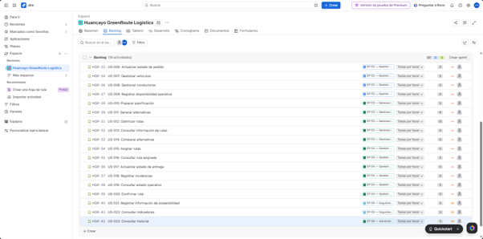

[← Volver al README Principal](../../README.md)

# 02 Artefactos Jira - DistriRapido V_1_0_0

Este documento constituye el informe de evidencia visual y funcional de la parametrización de Jira Software para el proyecto DistriRapido.

## Evidencia 2: Backlog Priorizado (Responsable: Clinton Janampa Navarro)
Vista general del Product Backlog ordenado por valor de negocio. Se utiliza la secuencia de Fibonacci para la estimación en Story Points y se han definido las prioridades (High/Medium). Todas las 23 historias están vinculadas a sus 6 Épicas correspondientes.

---

### Estado del Backlog:
- ✅ 23 Historias de Usuario creadas (US-001 a US-023)
- ✅ Story Points asignados en campo nativo de Jira (Fibonacci: 2, 3, 5, 8, 13)
- ✅ Prioridades definidas (High para US-001 a US-020, Medium para US-021 a US-023)
- ✅ 100% vinculadas a sus Épicas padre (EP-01 a EP-06)
- ✅ Ordenadas por prioridad en el backlog

---

*(Espacio reservado para que los compañeros agreguen las demás evidencias)*
- **Evidencia 1:** Roadmap del Proyecto (Responsable: Ricardo Miguel Flores Toribio)
- **Evidencia 3:** Sprint Planning & Sprint Goal (Responsable: Rosalyn Exkra Rupay Chira)
- **Evidencia 4:** Tablero Scrum Activo (Responsable: Carlos Adrián Veliz de la Cruz)
- **Evidencia 5:** Gestión de Versiones / Release (Responsable: José Antonio Albornoz Quiliano)

[← Volver al README Principal](../../README.md)
