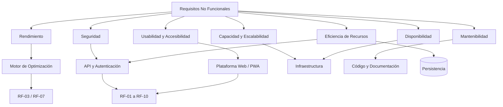

# 07. Requisitos no funcionales V_1_0_0

## 1. Datos del documento

| Campo | Detalle |
|---|---|
| **Proyecto** | Plataforma web con Algoritmo Genético para optimizar rutas sostenibles de última milla en Huancayo |
| **Documento** | Requisitos No Funcionales (RNF) |
| **Versión** | V_1_0_0 |
| **Ubicación** | `/docs/01 Inicio/` |
| **Fecha** | 2026-09-04 |
| **Equipo** | Flores, Toribio, Ricardo Miguel; Janampa, Navarro, Clinton; Rupay, Chira, Rosalyn Exkra; Veliz de la Cruz, Carlos Adrian |

---

# 2. Propósito

Este documento establece los atributos de calidad y las condiciones cuantificables que deberá cumplir la plataforma web para la gestión y optimización de rutas sostenibles de última milla en Huancayo.

Los requisitos se expresan mediante **escenarios de calidad**, siguiendo la estructura:

> **Fuente → Estímulo → Entorno → Artefacto → Respuesta → Medida SLA**

Cada requisito incorpora una medida verificable y un umbral cuantitativo, evitando expresiones ambiguas como *rápido*, *fácil*, *robusto*, *seguro* o *eficiente* cuando no estén acompañadas de un criterio objetivo.

La clasificación se relaciona principalmente con las características de calidad de **ISO/IEC 25010** y considera los estándares y referencias exigidos para el proyecto: **OWASP Top 10, WCAG, W3C y Green Software**.

---

# 3. Criterios generales de medición

| Criterio | Regla de aceptación |
|---|---|
| **Medición de rendimiento** | Se utilizarán pruebas repetibles y se registrará el tiempo transcurrido desde la solicitud hasta la respuesta completa. |
| **Percentiles** | Cuando se indique P95, al menos el 95 % de las solicitudes medidas deberá estar dentro del umbral establecido. |
| **Disponibilidad** | Se calculará como porcentaje de tiempo operativo disponible durante el horario definido. |
| **Seguridad** | Las vulnerabilidades se clasificarán según su severidad y se verificará el cumplimiento mediante análisis automatizados y pruebas de seguridad. |
| **Accesibilidad** | Se verificará el cumplimiento de WCAG 2.1 nivel AA mediante evaluación automática y revisión manual de criterios aplicables. |
| **Usabilidad** | Se utilizarán tareas definidas, tasa de éxito y tiempo máximo de ejecución. |
| **Escalabilidad** | Las pruebas utilizarán los volúmenes máximos establecidos en este documento. |
| **Documentación** | Se verificará la existencia y actualización de los entregables definidos. |

---

# 4. Matriz de Requisitos No Funcionales

| ID | Categoría ISO/IEC 25010 | Requisito | Medida principal |
|---|---|---|---|
| **RNF-001** | Eficiencia de desempeño | Rendimiento del algoritmo | ≤ 45 s para 150 pedidos y 15 vehículos |
| **RNF-002** | Eficiencia de desempeño | Re-optimización dinámica | < 30 s ante eventos definidos |
| **RNF-003** | Seguridad | Protección de la plataforma | 0 vulnerabilidades críticas y 0 vulnerabilidades altas sin resolver antes de producción |
| **RNF-004** | Seguridad | Protección de datos personales | 100 % de accesos a datos personales sujetos a autorización |
| **RNF-005** | Compatibilidad / Portabilidad | Compatibilidad web | Funcionamiento validado en los navegadores definidos |
| **RNF-006** | Usabilidad | Operación del modo conductor | ≥ 80 % de tareas completadas correctamente |
| **RNF-007** | Accesibilidad | WCAG | Cumplimiento WCAG 2.1 nivel AA |
| **RNF-008** | Capacidad / Escalabilidad | Capacidad operativa | ≥ 1,000 pedidos diarios y 50 vehículos |
| **RNF-009** | Fiabilidad / Disponibilidad | Continuidad del servicio | ≥ 99.5 % durante el horario operativo |
| **RNF-010** | Mantenibilidad | Calidad del código y documentación técnica | 100 % de módulos críticos documentados |
| **RNF-011** | Sostenibilidad / Eficiencia de recursos | Uso eficiente de recursos | Métricas de transferencia y consultas registradas |
| **RNF-012** | Documentación | Trazabilidad documental | 100 % de documentos técnicos obligatorios entregados y versionados |

---

# 5. Escenarios de Calidad

## RNF-001: Rendimiento del algoritmo de optimización

- **Categoría ISO/IEC 25010:** Eficiencia de desempeño.
- **Fuente:** Planificador autorizado.
- **Estímulo:** Solicitud de generación de una solución optimizada.
- **Entorno:** Operación normal con una carga de hasta 150 pedidos y 15 vehículos.
- **Artefacto:** Módulo de optimización de rutas.
- **Respuesta:** El sistema procesa la solicitud y devuelve una solución de rutas válida.
- **Medida SLA:** El **100 % de las pruebas válidas** del escenario deberá generar una solución válida en un tiempo máximo de **45 segundos**, utilizando el conjunto de prueba definido de hasta 150 pedidos y 15 vehículos.

### Criterio de aceptación

```text
DADO un conjunto válido de hasta 150 pedidos y 15 vehículos
CUANDO el planificador solicita la optimización
ENTONCES el sistema debe devolver una solución válida en ≤ 45 segundos.
```

> Este umbral de 45 segundos corresponde al requisito mínimo establecido por la consigna del proyecto.

---

## RNF-002: Re-optimización dinámica

- **Categoría ISO/IEC 25010:** Eficiencia de desempeño.
- **Fuente:** Sistema o usuario autorizado.
- **Estímulo:** Nuevo pedido, cancelación, accidente de tránsito o avería de vehículo que modifica una planificación vigente.
- **Entorno:** Operación normal con una ruta previamente generada.
- **Artefacto:** Módulo de re-optimización.
- **Respuesta:** El sistema recalcula la planificación afectada y devuelve una nueva solución válida.
- **Medida SLA:** El **100 % de las pruebas válidas** deberá producir una nueva solución en un tiempo **inferior a 30 segundos**.

### Criterio de aceptación

```text
DADO una planificación vigente
CUANDO se registra un evento que afecta la planificación
ENTONCES el sistema debe recalcular una solución válida en < 30 segundos.
```

---

## RNF-003: Seguridad de la plataforma

- **Categoría ISO/IEC 25010:** Seguridad.
- **Fuente:** Usuario no autorizado o proceso de evaluación de seguridad.
- **Estímulo:** Intento de explotación de vulnerabilidades web, incluyendo inyección, XSS, CSRF y ataques relacionados con autenticación.
- **Entorno:** Entorno de pruebas previo a producción y producción.
- **Artefacto:** Aplicación web, API y mecanismos de autenticación/autorización.
- **Respuesta:** El sistema debe rechazar la operación no autorizada, conservar la integridad de los datos y registrar el evento cuando corresponda.
- **Medida SLA:** **0 vulnerabilidades críticas y 0 vulnerabilidades altas abiertas** relacionadas con OWASP Top 10 antes de cada liberación a producción. Los hallazgos de menor severidad deberán contar con registro y tratamiento documentado.

### Criterio de aceptación

```text
DADO un endpoint protegido
CUANDO se ejecuta una prueba de seguridad con un patrón de ataque definido
ENTONCES la aplicación debe impedir el acceso no autorizado y mantener la integridad de la información.
```

---

## RNF-004: Protección de datos personales

- **Categoría ISO/IEC 25010:** Seguridad.
- **Fuente:** Usuario autenticado.
- **Estímulo:** Solicitud de acceso a información personal de clientes o conductores.
- **Entorno:** Operación normal.
- **Artefacto:** API, control de acceso y módulos que contienen datos personales.
- **Respuesta:** El sistema debe permitir únicamente las operaciones autorizadas según el rol del usuario.
- **Medida SLA:** **100 % de las pruebas de autorización** deberán impedir el acceso a datos o funciones no permitidas para el rol evaluado.

### Criterio de aceptación

```text
DADO un usuario con un rol determinado
CUANDO intenta acceder a información o función fuera de sus permisos
ENTONCES el sistema debe denegar la operación y no revelar la información protegida.
```

La gestión de datos personales se realizará considerando la **Ley N.° 29733, Ley de Protección de Datos Personales del Perú**, conforme a la consigna.

---

## RNF-005: Compatibilidad y portabilidad web

- **Categoría ISO/IEC 25010:** Compatibilidad y portabilidad.
- **Fuente:** Usuario final.
- **Estímulo:** Acceso a la plataforma desde navegadores compatibles.
- **Entorno:** Equipos de escritorio y dispositivos móviles contemplados en las pruebas del proyecto.
- **Artefacto:** Interfaz web y funciones principales.
- **Respuesta:** El sistema debe permitir ejecutar las funciones del MVP sin errores funcionales atribuibles al navegador.
- **Medida SLA:** El **100 % de los casos de prueba funcionales definidos para compatibilidad** deberá completarse correctamente en los navegadores y versiones declarados como objetivo del proyecto.

### Criterio de aceptación

```text
DADO un navegador incluido en la matriz oficial de compatibilidad
CUANDO el usuario ejecuta las funciones del MVP
ENTONCES las funciones deberán operar sin errores funcionales atribuibles al navegador.
```

La matriz exacta de navegadores y versiones deberá congelarse antes de la fase de pruebas.

---

## RNF-006: Usabilidad del modo conductor

- **Categoría ISO/IEC 25010:** Usabilidad.
- **Fuente:** Conductor participante en la prueba.
- **Estímulo:** Ejecución de tareas operativas definidas.
- **Entorno:** Dispositivo móvil durante una prueba controlada.
- **Artefacto:** Interfaz del modo conductor.
- **Respuesta:** El conductor debe completar las tareas previstas utilizando la interfaz disponible.
- **Medida SLA:** Al menos **80 % de los participantes** deberá completar correctamente el conjunto de tareas críticas sin asistencia directa del evaluador.

### Tareas mínimas de evaluación

1. Consultar la ruta asignada.
2. Identificar la siguiente entrega.
3. Consultar información de una entrega.
4. Registrar el resultado de una entrega.
5. Registrar una incidencia.

### Criterio de aceptación

```text
DADO un conductor participante y una cuenta de prueba
CUANDO ejecuta las tareas críticas del modo conductor
ENTONCES debe completar correctamente al menos el 80 % de las tareas sin asistencia directa.
```

---

## RNF-007: Accesibilidad

- **Categoría ISO/IEC 25010:** Usabilidad.
- **Fuente:** Usuario con necesidades de accesibilidad.
- **Estímulo:** Uso de la plataforma mediante mecanismos de interacción compatibles.
- **Entorno:** Interfaz web y modo conductor.
- **Artefacto:** Componentes de interfaz, navegación, formularios, controles y contenido.
- **Respuesta:** El sistema debe proporcionar interacción y presentación compatibles con los criterios aplicables de accesibilidad.
- **Medida SLA:** Cumplimiento de **WCAG 2.1 nivel AA** para los criterios aplicables a las interfaces entregadas; los criterios no conformes deberán quedar registrados y corregidos antes de la liberación final.

### Criterio de aceptación

```text
DADO un conjunto de páginas y flujos críticos del sistema
CUANDO se ejecuta la evaluación de accesibilidad
ENTONCES no deberá existir incumplimiento conocido sin registrar en los criterios WCAG 2.1 AA aplicables.
```

---

## RNF-008: Capacidad y escalabilidad

- **Categoría ISO/IEC 25010:** Eficiencia de desempeño.
- **Fuente:** Operación logística.
- **Estímulo:** Incremento del volumen diario de pedidos y vehículos.
- **Entorno:** Carga operativa máxima definida para el proyecto.
- **Artefacto:** Plataforma web, API, persistencia y módulo de optimización.
- **Respuesta:** El sistema debe procesar la carga objetivo sin pérdida de integridad funcional.
- **Medida SLA:** La plataforma deberá soportar **1,000 pedidos diarios y 50 vehículos** en el escenario de capacidad definido para las pruebas.

### Criterio de aceptación

```text
DADO un volumen de hasta 1,000 pedidos diarios y 50 vehículos
CUANDO se ejecutan las operaciones previstas de la plataforma
ENTONCES el sistema debe procesar las operaciones sin pérdida de datos ni errores funcionales no controlados.
```

La capacidad se considera una meta de diseño y prueba; no implica que el MVP deba operar permanentemente con ese volumen.

---

## RNF-009: Disponibilidad del servicio

- **Categoría ISO/IEC 25010:** Fiabilidad.
- **Fuente:** Usuario autorizado.
- **Estímulo:** Solicitud de acceso durante el horario operativo.
- **Entorno:** Operación del sistema durante el horario definido.
- **Artefacto:** Plataforma web y servicios necesarios para su funcionamiento.
- **Respuesta:** El sistema debe estar disponible para ejecutar las funciones operativas previstas.
- **Medida SLA:** Disponibilidad mínima de **99.5 %** durante el horario operativo definido de **05:00 a 22:00 horas**.

### Cálculo

```text
Disponibilidad (%) =
((Tiempo operativo programado - Tiempo de indisponibilidad) /
 Tiempo operativo programado) × 100
```

### Criterio de aceptación

```text
DADO un periodo de operación programado
CUANDO se registra el tiempo de disponibilidad del servicio
ENTONCES la disponibilidad calculada debe ser ≥ 99.5 %.
```

---

## RNF-010: Mantenibilidad y calidad técnica

- **Categoría ISO/IEC 25010:** Mantenibilidad.
- **Fuente:** Equipo de desarrollo.
- **Estímulo:** Modificación o corrección de un módulo del sistema.
- **Entorno:** Entorno de desarrollo y pruebas.
- **Artefacto:** Código fuente, estructura del proyecto y documentación técnica.
- **Respuesta:** El equipo debe poder identificar el módulo afectado, modificarlo y ejecutar las pruebas asociadas.
- **Medida SLA:** El **100 % de los módulos clasificados como críticos** deberá contar con documentación técnica mínima, pruebas asociadas y referencia dentro de la estructura del proyecto antes de la entrega final.

### Criterio de aceptación

```text
DADO un módulo crítico seleccionado
CUANDO se revisa su código, documentación y pruebas
ENTONCES deben existir los tres elementos definidos en este requisito.
```

---

## RNF-011: Eficiencia de recursos y Green Software

- **Categoría ISO/IEC 25010:** Eficiencia de desempeño.
- **Fuente:** Plataforma.
- **Estímulo:** Ejecución de operaciones de consulta, cálculo y transferencia de información.
- **Entorno:** Operación normal.
- **Artefacto:** Aplicación web, API y persistencia.
- **Respuesta:** El sistema debe evitar transferencias y consultas innecesarias para las operaciones implementadas.
- **Medida SLA:** El **100 % de los endpoints del MVP** deberá registrar métricas de tiempo de respuesta y tamaño de respuesta durante las pruebas de rendimiento; las consultas críticas deberán estar identificadas y revisadas antes de la entrega.

### Criterio de aceptación

```text
DADO un endpoint perteneciente al MVP
CUANDO se ejecutan sus pruebas de rendimiento
ENTONCES deben registrarse al menos tiempo de respuesta, tamaño del payload y resultado de la operación.
```

> Este requisito establece una base medible para aplicar principios de Green Software sin inventar una reducción porcentual de consumo que todavía no haya sido validada experimentalmente.

---

## RNF-012: Documentación y trazabilidad técnica

- **Categoría ISO/IEC 25010:** Mantenibilidad.
- **Fuente:** Equipo del proyecto.
- **Estímulo:** Revisión técnica o académica del sistema.
- **Entorno:** Repositorio del proyecto.
- **Artefacto:** Documentación, código fuente y entregables técnicos.
- **Respuesta:** La documentación requerida debe estar disponible, versionada y relacionada con la versión del sistema entregada.
- **Medida SLA:** **100 % de los documentos técnicos obligatorios** deberán encontrarse en el repositorio correspondiente antes de la entrega final.

### Documentación mínima

- Arquitectura del sistema.
- Diagramas UML requeridos.
- Diseño de base de datos.
- Manual de usuario.
- Manual de administrador.
- Documentación de API.
- Documentación del código.
- Plan y resultados de pruebas.
- Evidencias de rendimiento del algoritmo.

### Criterio de aceptación

```text
DADO el repositorio correspondiente a la versión entregada
CUANDO se verifica la documentación obligatoria
ENTONCES el 100 % de los documentos definidos debe estar disponible y versionado.
```

---

# 6. Matriz de verificación de métricas

| RNF | Métrica | Umbral | Método de verificación | Momento |
|---|---|---:|---|---|
| RNF-001 | Tiempo de optimización | ≤ 45 s | Prueba de rendimiento | Iteraciones y entrega final |
| RNF-002 | Tiempo de re-optimización | < 30 s | Prueba de rendimiento | Iteración de re-optimización |
| RNF-003 | Vulnerabilidades críticas/altas abiertas | 0 / 0 | Análisis de seguridad + pruebas | Antes de cada release |
| RNF-004 | Pruebas de autorización correctas | 100 % | Pruebas de seguridad | Antes de release |
| RNF-005 | Casos compatibles | 100 % | Matriz de compatibilidad | Pruebas |
| RNF-006 | Participantes que completan tareas | ≥ 80 % | Prueba de usabilidad | Validación del MVP |
| RNF-007 | Conformidad WCAG aplicable | Nivel AA | Evaluación de accesibilidad | Validación |
| RNF-008 | Capacidad | 1,000 pedidos/día + 50 vehículos | Prueba de carga/capacidad | Validación |
| RNF-009 | Disponibilidad | ≥ 99.5 % | Registro de disponibilidad | Operación |
| RNF-010 | Módulos críticos documentados/probados | 100 % | Revisión técnica | Entrega |
| RNF-011 | Endpoints MVP con métricas | 100 % | Pruebas de rendimiento | Iteraciones |
| RNF-012 | Documentación obligatoria disponible | 100 % | Auditoría del repositorio | Entrega final |

---

# 7. Relación con los estándares

| Estándar / guía | Aplicación en los RNF |
|---|---|
| **ISO/IEC 25010** | Clasificación de atributos de calidad: rendimiento, seguridad, usabilidad, compatibilidad, fiabilidad y mantenibilidad. |
| **OWASP Top 10** | Base para la identificación y prevención de vulnerabilidades web críticas. |
| **WCAG 2.1 AA** | Criterios de accesibilidad aplicables a la interfaz web y modo conductor. |
| **W3C** | Referencia para estándares y buenas prácticas de tecnologías web. |
| **Green Software** | Reducción y medición del uso innecesario de recursos computacionales y transferencia de datos. |
| **ISO 14083** | Referencia para la medición y reporte de emisiones asociadas a actividades de transporte y logística, cuando corresponda al modelo de cálculo del proyecto. |

---

# 8. Límites de esta versión

Para evitar introducir decisiones técnicas prematuras, los siguientes elementos **no quedan congelados en V_1_0_0**:

1. Tipo exacto de infraestructura de despliegue.
2. Proveedor específico de hosting.
3. Proveedor específico de mapas o tráfico.
4. Parámetros definitivos del Algoritmo Genético.
5. Fórmula definitiva de la función de aptitud.
6. Fórmula definitiva de equivalencia entre CO₂ y árboles.
7. Navegadores y versiones finales de la matriz de compatibilidad.
8. Herramientas específicas para las pruebas de seguridad y accesibilidad.
9. Arquitectura física definitiva del servidor.

Estos elementos serán definidos en los documentos de **arquitectura, diseño técnico y plan de pruebas**, manteniendo la trazabilidad con los RNF correspondientes.

---

# 9. Trazabilidad con los Requisitos Funcionales

| RNF | RF relacionados |
|---|---|
| **RNF-001** | RF-03 Generación de Rutas Optimizadas |
| **RNF-002** | RF-07 Re-optimización Dinámica |
| **RNF-003** | RF-01, RF-02, RF-08, RF-09 |
| **RNF-004** | RF-01, RF-02, RF-08, RF-09 |
| **RNF-005** | RF-01 a RF-10 |
| **RNF-006** | RF-04, RF-05, RF-07, RF-09 |
| **RNF-007** | RF-04, RF-05, RF-09 |
| **RNF-008** | RF-01, RF-02, RF-03, RF-07 |
| **RNF-009** | RF-01 a RF-10 |
| **RNF-010** | RF-01 a RF-10 |
| **RNF-011** | RF-03, RF-04, RF-05, RF-06, RF-07 |
| **RNF-012** | RF-01 a RF-10 |

---

# 10. Relación con la arquitectura



---

# 11. Criterio de aceptación global

La solución será considerada conforme con este documento cuando:

1. Los **12 RNF** estén implementados o preparados para su verificación según corresponda a la etapa del proyecto.
2. Cada RNF pueda comprobarse mediante una prueba, revisión documental o medición definida.
3. Los umbrales cuantitativos establecidos sean registrados en las evidencias de prueba.
4. Los resultados que no cumplan un umbral sean documentados como incidencias.
5. Las excepciones o modificaciones posteriores sean registradas mediante control de versiones.
6. No se utilicen adjetivos calificativos como sustitutos de métricas.
7. Los resultados de las pruebas sean trazables hacia el RNF correspondiente.

---

# 12. Control de versión

| Versión | Fecha | Descripción | Responsable |
|---|---|---|---|
| **V_1_0_0** | 2026-09-04 | Línea base inicial de requisitos no funcionales con escenarios de calidad, métricas cuantificables y adaptación al contexto de Huancayo. | Equipo del proyecto |
