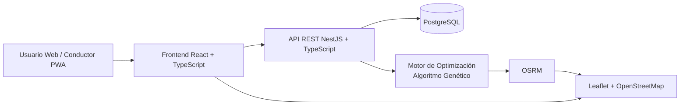
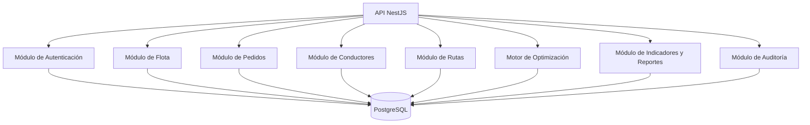
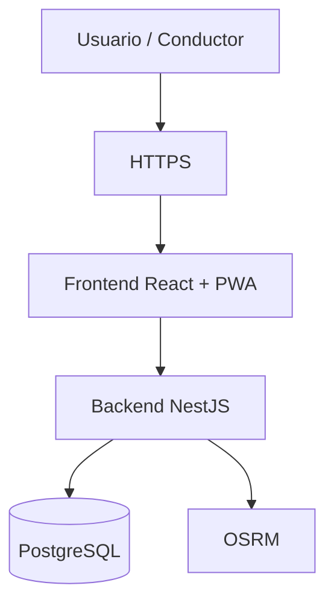

# 10. Stack tecnológico V_1_0_0

## 1. Datos del documento

| Campo | Detalle |
|---|---|
| **Proyecto** | Plataforma web con Algoritmo Genético para optimizar rutas sostenibles de última milla en Huancayo |
| **Documento** | Evaluación e Identificación del Stack Tecnológico |
| **Versión** | V_1_0_0 |
| **Ubicación** | `docs/01 Inicio/` |
| **Fecha** | 2026-09-04 |
| **Equipo** | Flores, Toribio, Ricardo Miguel; Janampa, Navarro, Clinton; Rupay, Chira, Rosalyn Exkra; Veliz de la Cruz, Carlos Adrian |

---

# 2. Objetivo

Evaluar alternativas tecnológicas para seleccionar el stack que dará soporte al desarrollo de la plataforma web responsive con modo conductor **PWA**, orientada a la optimización sostenible de rutas de última milla mediante un **Algoritmo Genético** en la ciudad de Huancayo.

La evaluación considera:

- Capacidad técnica del equipo.
- Curva de aprendizaje.
- Costo de infraestructura.
- Soporte comunitario.
- Escalabilidad.
- Integración con servicios geográficos.
- Eficiencia energética / Eco-Design.
- Facilidad de despliegue en hosting.
- Compatibilidad con la arquitectura definida para el MVP.

---

# 3. Arquitectura tecnológica de referencia

La línea base tecnológica contempla una arquitectura modular de tres capas:



### Principio arquitectónico

Para el MVP se utilizará una **arquitectura modular de tres capas**, evitando introducir microservicios innecesarios para el alcance académico inicial.

La solución contempla:

- **Frontend:** React + TypeScript.
- **Backend:** Node.js + NestJS + TypeScript.
- **API:** REST.
- **Base de datos:** PostgreSQL.
- **ORM:** Prisma.
- **Mapas:** Leaflet + OpenStreetMap.
- **Enrutamiento:** OSRM.
- **Optimización:** Algoritmo Genético.
- **PWA:** modo conductor sobre la aplicación web responsive.
- **Contenedorización:** Docker.
- **Despliegue:** hosting/VPS compatible con Node.js y PostgreSQL.
- **Seguridad de transporte:** HTTPS.

> **Decisión de alcance:** Google Maps/Waze no constituyen una dependencia obligatoria del MVP. La arquitectura queda preparada para integrar información adicional de tráfico posteriormente.

---

# 4. Alternativas evaluadas

Se consideran las tres alternativas establecidas en la consigna.

### Alternativa 1 — MERN

**Node.js + Express + React + MongoDB**

### Alternativa 2 — Python

**Python + FastAPI + React + PostgreSQL**

### Alternativa 3 — Java

**Java Spring Boot + Angular + PostgreSQL**

---

# 5. Criterios de evaluación

Cada alternativa será valorada en una escala de **1 a 5**, donde:

| Valor | Interpretación |
|---:|---|
| **1** | Muy desfavorable |
| **2** | Desfavorable |
| **3** | Aceptable |
| **4** | Favorable |
| **5** | Muy favorable |

Los criterios se ponderan considerando las características reales del proyecto y no únicamente las características generales de cada tecnología.

| Criterio | Peso |
|---|---:|
| Curva de aprendizaje y adecuación al equipo | **20 %** |
| Costo de infraestructura y despliegue | **15 %** |
| Soporte comunitario y disponibilidad de recursos | **10 %** |
| Eficiencia energética / Eco-Design | **15 %** |
| Escalabilidad | **15 %** |
| Integración con el proyecto geográfico y PWA | **10 %** |
| Facilidad de despliegue en hosting | **15 %** |
| **Total** | **100 %** |

---

# 6. Evaluación comparativa

| Criterio | Peso | MERN | FastAPI + React + PostgreSQL | Spring Boot + Angular + PostgreSQL |
|---|---:|---:|---:|---:|
| Curva de aprendizaje y adecuación al equipo | 20 % | **5** | **4** | **3** |
| Costo de infraestructura y despliegue | 15 % | **4** | **5** | **3** |
| Soporte comunitario | 10 % | **5** | **4** | **5** |
| Eficiencia energética / Eco-Design | 15 % | **4** | **5** | **3** |
| Escalabilidad | 15 % | **4** | **4** | **5** |
| Integración geográfica y PWA | 10 % | **5** | **5** | **4** |
| Facilidad de despliegue en hosting | 15 % | **5** | **4** | **3** |
| **Puntaje ponderado / 5** | **100 %** | **4.55** | **4.45** | **3.55** |

---

# 7. Análisis de las alternativas

## 7.1 Alternativa 1 — MERN

### Composición

- Node.js
- Express
- React
- MongoDB

### Ventajas

- Utiliza JavaScript tanto en frontend como en backend.
- Presenta una curva de aprendizaje favorable para un equipo que trabaja con Node.js y React.
- Dispone de un ecosistema amplio.
- Facilita el desarrollo de una aplicación web responsive y PWA.
- Permite desplegar el backend Node.js en un hosting/VPS compatible.
- Express permite construir APIs REST con una estructura sencilla.

### Desventajas

- MongoDB no corresponde a la base de datos seleccionada para la línea base del proyecto.
- El modelo documental no ofrece las mismas ventajas que PostgreSQL para las relaciones entre pedidos, clientes, vehículos, conductores, rutas y entregas.
- Sería necesario modificar la arquitectura previamente establecida.

### Evaluación

La alternativa obtiene un resultado alto, pero **no será seleccionada**, porque la solución ya requiere una base de datos relacional para representar las relaciones operativas del dominio.

---

# 8. Alternativa 2 — Python / FastAPI + React + PostgreSQL

### Composición

- Python
- FastAPI
- React
- TypeScript
- PostgreSQL

### Ventajas

- FastAPI proporciona un framework orientado a APIs.
- PostgreSQL permite modelar relaciones entre entidades del dominio.
- Python posee un ecosistema amplio para algoritmos y procesamiento de datos.
- Presenta buenas características para desarrollar el componente de optimización.
- Puede ofrecer un consumo de recursos favorable.
- Mantiene React para la interfaz web y PWA.

### Desventajas

- Introduce Python en el backend mientras el frontend utiliza TypeScript.
- El equipo tendría que mantener dos lenguajes principales.
- No coincide con la decisión previamente congelada de utilizar Node.js como backend.
- Requeriría modificar la arquitectura tecnológica establecida.

### Evaluación

La alternativa presenta un resultado muy competitivo y es técnicamente viable, especialmente para el componente algorítmico. Sin embargo, **no se selecciona para esta línea base**, debido a la decisión previa de utilizar Node.js en el backend y mantener un stack coherente con la capacidad del equipo.

---

# 9. Alternativa 3 — Java Spring Boot + Angular + PostgreSQL

### Composición

- Java
- Spring Boot
- Angular
- PostgreSQL

### Ventajas

- Ecosistema empresarial consolidado.
- Tipado fuerte.
- Buen soporte para aplicaciones de gran escala.
- PostgreSQL se adapta al modelo relacional del proyecto.
- Spring Boot dispone de mecanismos robustos para estructurar aplicaciones backend.

### Desventajas

- Mayor curva de aprendizaje para el equipo frente a las alternativas consideradas.
- Mayor complejidad inicial para el MVP.
- Mayor consumo de recursos en determinados escenarios de ejecución.
- Angular y Spring Boot incrementarían la carga tecnológica del proyecto.
- No coincide con el stack previamente definido.

### Evaluación

Es una alternativa técnicamente sólida, pero su complejidad y costo operativo relativo no resultan adecuados para el alcance y perfil del equipo en esta etapa.

---

# 10. Comparación cualitativa

| Factor | MERN | FastAPI + React + PostgreSQL | Spring Boot + Angular + PostgreSQL |
|---|---|---|---|
| Desarrollo rápido del MVP | Alto | Alto | Medio |
| Unificación del lenguaje | **Alta** | Media | Baja |
| Modelo relacional | Bajo con MongoDB | **Alto** | **Alto** |
| Soporte para optimización | Medio | **Alto** | Alto |
| Desarrollo PWA | **Alto** | Alto | Alto |
| Facilidad de hosting | **Alta** | Alta | Media |
| Complejidad inicial | Baja | Media | Alta |
| Adecuación al stack congelado | **Alta** | Baja | Baja |

---

# 11. Stack tecnológico seleccionado

## 11.1 Selección final

Se selecciona la siguiente combinación tecnológica:

| Capa | Tecnología seleccionada |
|---|---|
| **Frontend** | React + TypeScript |
| **Aplicación web** | React |
| **Modo conductor** | PWA |
| **Backend** | Node.js + NestJS + TypeScript |
| **API** | REST |
| **Base de datos** | PostgreSQL |
| **ORM** | Prisma |
| **Motor de optimización** | Algoritmo Genético |
| **Motor de rutas** | OSRM |
| **Mapas** | Leaflet + OpenStreetMap |
| **Contenedores** | Docker |
| **Despliegue** | Hosting/VPS |
| **Comunicación segura** | HTTPS |

---

# 12. Justificación técnica formal

La combinación **React + TypeScript + Node.js + NestJS + PostgreSQL + Prisma** es seleccionada para la línea base del proyecto porque proporciona un equilibrio entre capacidad técnica, complejidad de desarrollo, despliegue y sostenibilidad computacional.

### Backend: Node.js + NestJS

Node.js se mantiene como plataforma de ejecución del backend debido a la decisión previamente establecida para el proyecto. NestJS proporciona una estructura modular que facilita separar responsabilidades como autenticación, pedidos, flota, conductores, rutas, optimización y auditoría.

El uso de TypeScript tanto en frontend como en backend permite compartir criterios de tipado y reducir la fragmentación tecnológica del equipo.

### Frontend: React + TypeScript

React permitirá desarrollar la interfaz web responsive y el modo conductor PWA sobre una misma base de frontend.

TypeScript permitirá definir estructuras de datos y contratos de comunicación entre componentes con mayor control durante el desarrollo.

### Base de datos: PostgreSQL

PostgreSQL se selecciona porque el dominio contiene relaciones entre:

- Clientes.
- Pedidos.
- Conductores.
- Vehículos.
- Rutas.
- Entregas.
- Parámetros.
- Registros de auditoría.

El modelo relacional facilita mantener integridad entre estas entidades.

### ORM: Prisma

Prisma se utilizará como capa de acceso a datos desde el backend Node.js. Su función será facilitar el trabajo con PostgreSQL mediante modelos y consultas tipadas.

### Algoritmo de optimización

El **Algoritmo Genético** constituye el componente central de optimización. Su función será evaluar soluciones candidatas de rutas considerando las restricciones y objetivos establecidos por el negocio.

Entre los factores considerados se encuentran:

- Distancia.
- Tiempo.
- Capacidad.
- Ventanas de tiempo.
- Consumo.
- Emisiones de CO₂.
- Penalizaciones por incumplimiento.

### OSRM

OSRM será utilizado como motor de enrutamiento para obtener información de recorridos sobre la red vial disponible.

La arquitectura mantiene separada la responsabilidad:

```text
Algoritmo Genético
        ↓
Solicita/evalúa recorridos
        ↓
OSRM
        ↓
Distancias y tiempos de recorrido
```

### Leaflet + OpenStreetMap

Leaflet se utilizará para la visualización cartográfica de las rutas y puntos de entrega.

OpenStreetMap funcionará como fuente cartográfica, de acuerdo con las condiciones de uso y atribución correspondientes.

### PWA

El modo conductor se implementará como PWA sobre la aplicación web.

Esto permite mantener una única plataforma tecnológica y proporcionar al conductor una experiencia orientada al uso desde dispositivos móviles, sin desarrollar inicialmente una aplicación móvil nativa independiente.

---

# 13. Consideración de eficiencia energética / Eco-Design

La sostenibilidad del proyecto no se limita al resultado de las rutas; también se considerará el consumo computacional de la plataforma.

Se aplicarán los siguientes criterios:

1. Mantener una arquitectura modular sin microservicios innecesarios para el MVP.
2. Evitar procesos backend permanentes que no sean necesarios.
3. Limitar el número de solicitudes externas durante la optimización.
4. Reutilizar resultados de enrutamiento cuando sea técnicamente viable.
5. Utilizar PostgreSQL con consultas optimizadas.
6. Evitar transferir información innecesaria al frontend.
7. Implementar la PWA evitando recursos de gran tamaño que no sean necesarios.
8. Ejecutar el Algoritmo Genético con parámetros controlados de población, generaciones y criterios de parada.

---

# 14. Estrategia de escalabilidad

La solución no utilizará microservicios en el MVP.

Se aplicará una estructura modular dentro del backend:



Esta organización permite evolucionar posteriormente componentes específicos sin obligar al proyecto a adoptar una arquitectura distribuida desde el inicio.

---

# 15. Estrategia de despliegue

El despliegue inicial se plantea sobre un **hosting/VPS** compatible con Node.js, PostgreSQL y Docker.



### Requisitos iniciales del entorno

- Node.js.
- PostgreSQL.
- Docker.
- HTTPS.
- Variables de entorno para configuración.
- Sistema de respaldo de base de datos.
- Dominio o subdominio para la plataforma.

---

# 16. Tecnologías descartadas para la línea base

| Tecnología / alternativa | Motivo |
|---|---|
| **MongoDB** | No se selecciona como base principal debido a la necesidad de manejar relaciones entre entidades del dominio mediante un modelo relacional. |
| **FastAPI** | Alternativa viable, pero se mantiene Node.js como backend por decisión de línea base y coherencia del stack del equipo. |
| **Spring Boot** | Se descarta para el MVP por mayor complejidad y curva de aprendizaje para el equipo. |
| **Angular** | Se mantiene React debido a la línea base del frontend. |
| **Microservicios** | Se descartan para el MVP por introducir complejidad operativa innecesaria. |
| **Google Maps / Waze como dependencia obligatoria** | No son necesarios para el MVP; la arquitectura mantiene posibilidad de integración futura. |
| **Aplicación móvil nativa independiente** | Se utiliza PWA para evitar duplicar el desarrollo frontend durante el MVP. |

---

# 17. Matriz de alineación tecnológica

| Necesidad del proyecto | Tecnología | Justificación |
|---|---|---|
| Interfaz web | React | Desarrollo de interfaz modular. |
| Tipado | TypeScript | Consistencia y control de estructuras de datos. |
| Backend | Node.js + NestJS | Backend modular y compatible con la decisión tecnológica del equipo. |
| Persistencia | PostgreSQL | Modelo relacional para entidades logísticas. |
| Acceso a datos | Prisma | Integración tipada con PostgreSQL. |
| Optimización | Algoritmo Genético | Resolución del problema de optimización de rutas. |
| Enrutamiento | OSRM | Cálculo de recorridos, distancias y tiempos. |
| Visualización geográfica | Leaflet + OpenStreetMap | Representación de rutas y ubicaciones. |
| Uso móvil | PWA | Acceso desde dispositivos móviles sin aplicación nativa separada. |
| Despliegue | Docker + Hosting/VPS | Portabilidad y simplificación del despliegue. |
| Seguridad de transporte | HTTPS | Protección de comunicaciones. |

---

# 18. Decisión final

> **El stack tecnológico seleccionado para el proyecto es React + TypeScript en frontend; Node.js + NestJS + TypeScript en backend; PostgreSQL + Prisma como persistencia; Leaflet + OpenStreetMap para visualización geográfica; OSRM como motor de rutas; Algoritmo Genético como motor de optimización; PWA para el modo conductor; y Docker para el despliegue sobre un hosting/VPS.**

La decisión se fundamenta en que este conjunto mantiene una arquitectura coherente con el alcance del MVP, permite desarrollar la solución con una cantidad controlada de tecnologías, facilita el despliegue en hosting, soporta el modelo relacional requerido por el dominio y permite implementar el componente de optimización sin introducir complejidad arquitectónica innecesaria.

---

# 19. Relación con los requisitos no funcionales

| RNF | Aporte del stack |
|---|---|
| **RNF-01 Rendimiento** | Node.js/NestJS, PostgreSQL y OSRM permiten estructurar el procesamiento de solicitudes y rutas. |
| **RNF-02 Seguridad** | NestJS, control de acceso, PostgreSQL y HTTPS permiten implementar los mecanismos de seguridad definidos. |
| **RNF-03 Accesibilidad** | React permite implementar interfaces compatibles con los criterios de accesibilidad establecidos. |
| **RNF-04 Escalabilidad** | Arquitectura modular, PostgreSQL y Docker permiten aumentar recursos del despliegue cuando sea necesario. |
| **RNF-05 Usabilidad** | React + PWA permiten construir interfaces orientadas a los diferentes perfiles de usuario. |
| **RNF-06 Disponibilidad** | El despliegue mediante hosting/VPS y la estrategia de respaldo permiten alcanzar la meta definida para el PMV. |
| **RNF-07 Documentación** | El stack será documentado mediante configuración, estructura de proyecto y procedimientos de despliegue. |

---

# 20. Control de versión

| Versión | Fecha | Descripción | Responsable |
|---|---|---|---|
| **V_1_0_0** | 2026-09-04 | Línea base del stack tecnológico seleccionado para la plataforma de optimización de rutas sostenibles de última milla en Huancayo. | Equipo del proyecto |
