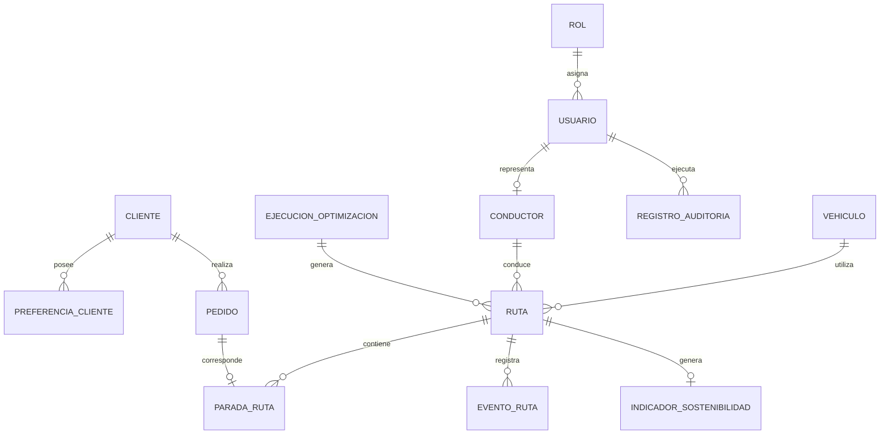
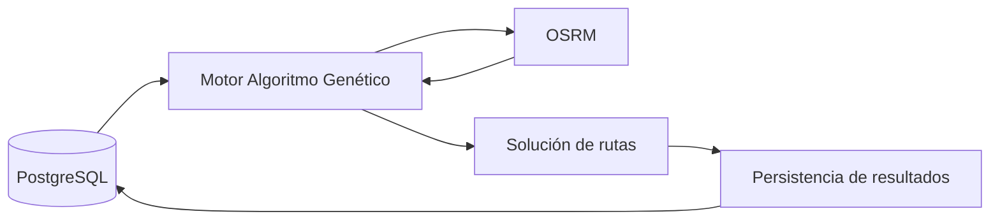

# 11. Base de datos V_1_0_0

## 1. Datos del documento

| Campo | Detalle |
|---|---|
| **Proyecto** | Plataforma web con Algoritmo Genético para optimizar rutas sostenibles de última milla en Huancayo |
| **Documento** | Diseño e Ingeniería de Base de Datos |
| **Versión** | V_1_0_0 |
| **Ubicación** | `docs/01 Inicio/` |
| **Fecha** | 2026-09-04 |
| **Motor de BD** | PostgreSQL |
| **ORM** | Prisma |
| **Equipo** | Flores, Toribio, Ricardo Miguel; Janampa, Navarro, Clinton; Rupay, Chira, Rosalyn Exkra; Veliz de la Cruz, Carlos Adrian |

---

# 2. Objetivo

Definir el diseño conceptual, lógico y físico de la base de datos de la plataforma, utilizando **PostgreSQL** como sistema gestor de base de datos y **Prisma** como ORM.

El diseño debe soportar principalmente:

- Gestión de usuarios y roles.
- Gestión de vehículos.
- Gestión de conductores.
- Gestión de clientes.
- Gestión de pedidos.
- Gestión de rutas.
- Paradas y entregas.
- Ejecuciones del Algoritmo Genético.
- Resultados de optimización.
- Indicadores de sostenibilidad.
- Eventos que provocan re-optimización.
- Auditoría de operaciones.

El diseño se mantiene alineado con la arquitectura tecnológica seleccionada: **React + TypeScript / NestJS + Node.js / PostgreSQL + Prisma / OSRM / Leaflet + OpenStreetMap / PWA**.

---

# 3. Criterios de diseño

La base de datos se diseñará bajo los siguientes criterios:

1. Utilizar PostgreSQL como base de datos relacional.
2. Mantener integridad referencial mediante claves primarias y foráneas.
3. Aplicar normalización hasta **Tercera Forma Normal (3FN)**.
4. Evitar almacenar datos derivados cuando puedan calcularse a partir de datos base.
5. Utilizar tipos numéricos adecuados para coordenadas, pesos, volúmenes y métricas.
6. Utilizar `TIMESTAMPTZ` para información temporal.
7. Utilizar UUID como identificador principal.
8. Aplicar restricciones `NOT NULL`, `UNIQUE`, `CHECK` y `FOREIGN KEY` donde corresponda.
9. Crear índices para consultas frecuentes.
10. Mantener separadas las entidades operativas de los resultados de optimización.

---

# 4. Modelo Conceptual

## 4.1 Entidades principales

El modelo conceptual se compone de las siguientes entidades:

| Entidad | Propósito |
|---|---|
| **Usuario** | Gestiona las credenciales y acceso al sistema. |
| **Rol** | Define el perfil de acceso del usuario. |
| **Conductor** | Representa al conductor que puede recibir rutas. |
| **Vehículo** | Representa los vehículos disponibles para reparto. |
| **Cliente** | Representa al destinatario del pedido. |
| **PreferenciaCliente** | Almacena preferencias de entrega del cliente. |
| **Pedido** | Representa una solicitud de entrega. |
| **Ruta** | Representa una planificación de recorrido. |
| **ParadaRuta** | Representa el orden de las entregas dentro de una ruta. |
| **EjecucionOptimizacion** | Registra cada ejecución del Algoritmo Genético. |
| **EventoRuta** | Registra eventos que pueden provocar re-optimización. |
| **IndicadorSostenibilidad** | Almacena métricas ambientales y operativas de una ruta. |
| **RegistroAuditoria** | Mantiene trazabilidad de operaciones relevantes. |

## 4.2 Diagrama Entidad-Relación conceptual



> **Decisión:** `Pedido` y `ParadaRuta` se mantienen como entidades separadas porque un pedido pertenece al negocio y una parada representa su posición dentro de una planificación concreta.

---

# 5. Modelo Lógico

## 5.1 Tabla: roles

| Atributo | Tipo lógico | Restricción |
|---|---|---|
| `rol_id` | UUID | PK |
| `nombre` | VARCHAR(50) | UNIQUE, NOT NULL |
| `descripcion` | VARCHAR(255) | NOT NULL |

Roles iniciales:

- Administrador.
- Operador / Técnico.
- Usuario Final / Conductor.
- Auditor Externo.

---

## 5.2 Tabla: usuarios

| Atributo | Tipo lógico | Restricción |
|---|---|---|
| `usuario_id` | UUID | PK |
| `rol_id` | UUID | FK → roles |
| `email` | VARCHAR(255) | UNIQUE, NOT NULL |
| `password_hash` | VARCHAR(255) | NOT NULL |
| `estado` | VARCHAR(20) | NOT NULL |
| `creado_en` | TIMESTAMPTZ | NOT NULL |

---

## 5.3 Tabla: conductores

| Atributo | Tipo lógico | Restricción |
|---|---|---|
| `conductor_id` | UUID | PK |
| `usuario_id` | UUID | FK → usuarios, UNIQUE |
| `nombre_completo` | VARCHAR(150) | NOT NULL |
| `dni` | VARCHAR(20) | UNIQUE, NOT NULL |
| `licencia_categoria` | VARCHAR(20) | NOT NULL |
| `anios_experiencia` | SMALLINT | NOT NULL, CHECK >= 0 |
| `telefono` | VARCHAR(30) | NOT NULL |
| `disponibilidad_inicio` | TIME | NOT NULL |
| `disponibilidad_fin` | TIME | NOT NULL |
| `latitud_inicio` | NUMERIC(9,6) | NOT NULL |
| `longitud_inicio` | NUMERIC(9,6) | NOT NULL |
| `estado` | VARCHAR(20) | NOT NULL |

---

## 5.4 Tabla: vehículos

| Atributo | Tipo lógico | Restricción |
|---|---|---|
| `vehiculo_id` | UUID | PK |
| `placa` | VARCHAR(15) | UNIQUE, NOT NULL |
| `tipo` | VARCHAR(30) | NOT NULL |
| `capacidad_carga_kg` | NUMERIC(10,2) | NOT NULL, CHECK > 0 |
| `capacidad_volumen_m3` | NUMERIC(10,3) | NULL |
| `consumo_km_l` | NUMERIC(10,3) | NOT NULL, CHECK > 0 |
| `factor_emision_kg_co2_km` | NUMERIC(10,5) | NOT NULL, CHECK >= 0 |
| `anio_fabricacion` | SMALLINT | NOT NULL |
| `estado` | VARCHAR(20) | NOT NULL |

---

## 5.5 Tabla: clientes

| Atributo | Tipo lógico | Restricción |
|---|---|---|
| `cliente_id` | UUID | PK |
| `nombre` | VARCHAR(150) | NOT NULL |
| `telefono` | VARCHAR(30) | NULL |
| `email` | VARCHAR(255) | NULL |
| `direccion` | VARCHAR(255) | NOT NULL |
| `referencia` | VARCHAR(255) | NULL |
| `latitud` | NUMERIC(9,6) | NOT NULL |
| `longitud` | NUMERIC(9,6) | NOT NULL |
| `estado` | VARCHAR(20) | NOT NULL |

---

## 5.6 Tabla: preferencias_cliente

| Atributo | Tipo lógico | Restricción |
|---|---|---|
| `preferencia_id` | UUID | PK |
| `cliente_id` | UUID | FK → clientes |
| `hora_inicio_preferida` | TIME | NULL |
| `hora_fin_preferida` | TIME | NULL |
| `restricciones_acceso` | TEXT | NULL |
| `punto_referencia` | VARCHAR(255) | NULL |

---

## 5.7 Tabla: pedidos

| Atributo | Tipo lógico | Restricción |
|---|---|---|
| `pedido_id` | UUID | PK |
| `cliente_id` | UUID | FK → clientes |
| `peso_kg` | NUMERIC(10,2) | NOT NULL, CHECK > 0 |
| `volumen_m3` | NUMERIC(10,3) | NOT NULL, CHECK > 0 |
| `ventana_inicio` | TIMESTAMPTZ | NOT NULL |
| `ventana_fin` | TIMESTAMPTZ | NOT NULL |
| `prioridad` | VARCHAR(20) | NOT NULL |
| `tipo_producto` | VARCHAR(30) | NOT NULL |
| `estado` | VARCHAR(20) | NOT NULL |
| `creado_en` | TIMESTAMPTZ | NOT NULL |

---

## 5.8 Tabla: ejecuciones_optimizacion

| Atributo | Tipo lógico | Restricción |
|---|---|---|
| `ejecucion_id` | UUID | PK |
| `usuario_id` | UUID | FK → usuarios |
| `inicio_en` | TIMESTAMPTZ | NOT NULL |
| `fin_en` | TIMESTAMPTZ | NULL |
| `cantidad_pedidos` | INTEGER | NOT NULL |
| `cantidad_vehiculos` | INTEGER | NOT NULL |
| `generaciones` | INTEGER | NOT NULL |
| `estado` | VARCHAR(20) | NOT NULL |
| `distancia_total_km` | NUMERIC(12,3) | NULL |
| `tiempo_total_min` | NUMERIC(12,2) | NULL |
| `penalizacion_total` | NUMERIC(12,4) | NULL |

---

## 5.9 Tabla: rutas

| Atributo | Tipo lógico | Restricción |
|---|---|---|
| `ruta_id` | UUID | PK |
| `ejecucion_id` | UUID | FK → ejecuciones_optimizacion |
| `vehiculo_id` | UUID | FK → vehiculos |
| `conductor_id` | UUID | FK → conductores |
| `estado` | VARCHAR(20) | NOT NULL |
| `distancia_total_km` | NUMERIC(12,3) | NOT NULL |
| `tiempo_total_min` | NUMERIC(12,2) | NOT NULL |
| `iniciada_en` | TIMESTAMPTZ | NULL |
| `finalizada_en` | TIMESTAMPTZ | NULL |

---

## 5.10 Tabla: paradas_ruta

| Atributo | Tipo lógico | Restricción |
|---|---|---|
| `parada_id` | UUID | PK |
| `ruta_id` | UUID | FK → rutas |
| `pedido_id` | UUID | FK → pedidos |
| `secuencia` | INTEGER | NOT NULL |
| `llegada_estimada` | TIMESTAMPTZ | NULL |
| `salida_estimada` | TIMESTAMPTZ | NULL |
| `distancia_desde_anterior_km` | NUMERIC(12,3) | NULL |
| `tiempo_desde_anterior_min` | NUMERIC(12,2) | NULL |
| `estado` | VARCHAR(20) | NOT NULL |

Restricción:

```text
(ruta_id, secuencia) UNIQUE
```

---

## 5.11 Tabla: eventos_ruta

| Atributo | Tipo lógico | Restricción |
|---|---|---|
| `evento_id` | UUID | PK |
| `ruta_id` | UUID | FK → rutas |
| `usuario_id` | UUID | FK → usuarios |
| `tipo_evento` | VARCHAR(40) | NOT NULL |
| `descripcion` | TEXT | NOT NULL |
| `registrado_en` | TIMESTAMPTZ | NOT NULL |
| `requiere_reoptimizacion` | BOOLEAN | NOT NULL |

Tipos iniciales:

- NUEVO_PEDIDO.
- CANCELACION_PEDIDO.
- ACCIDENTE.
- AVERIA_VEHICULO.
- CAMBIO_TRAFICO.
- OTRO.

---

## 5.12 Tabla: indicadores_sostenibilidad

| Atributo | Tipo lógico | Restricción |
|---|---|---|
| `indicador_id` | UUID | PK |
| `ruta_id` | UUID | FK → rutas, UNIQUE |
| `emisiones_co2_kg` | NUMERIC(12,4) | NOT NULL |
| `combustible_estimado_l` | NUMERIC(12,4) | NOT NULL |
| `combustible_ahorrado_l` | NUMERIC(12,4) | NOT NULL |
| `cumplimiento_ventanas_pct` | NUMERIC(5,2) | NOT NULL |
| `ahorro_vs_secuencial_pct` | NUMERIC(5,2) | NOT NULL |
| `costo_combustible` | NUMERIC(12,2) | NULL |
| `calculado_en` | TIMESTAMPTZ | NOT NULL |

---

## 5.13 Tabla: registros_auditoria

| Atributo | Tipo lógico | Restricción |
|---|---|---|
| `auditoria_id` | UUID | PK |
| `usuario_id` | UUID | FK → usuarios |
| `entidad` | VARCHAR(80) | NOT NULL |
| `entidad_id` | UUID | NULL |
| `accion` | VARCHAR(30) | NOT NULL |
| `detalle` | JSONB | NULL |
| `ip_origen` | INET | NULL |
| `registrado_en` | TIMESTAMPTZ | NOT NULL |

---

# 6. Normalización a 3FN

El modelo se plantea en **Tercera Forma Normal (3FN)**.

### Primera Forma Normal (1FN)

Se garantiza que:

- Cada atributo contiene un valor atómico.
- No se almacenan listas dentro de columnas relacionales.
- Los grupos repetitivos se separan en entidades independientes.

Ejemplo:

```text
pedido
  ├── pedido_id
  ├── cliente_id
  ├── peso_kg
  └── volumen_m3
```

Los datos de preferencias se almacenan en `preferencias_cliente` y no como múltiples columnas repetitivas en `clientes`.

### Segunda Forma Normal (2FN)

Las entidades utilizan claves primarias que identifican de forma única cada registro.

En `paradas_ruta`, por ejemplo, la combinación:

```text
ruta_id + secuencia
```

identifica la posición de una parada dentro de una ruta.

### Tercera Forma Normal (3FN)

Los atributos no clave dependen de la clave de su propia entidad y no de otros atributos no clave.

Ejemplo:

```text
pedido_id → cliente_id
cliente_id → nombre, dirección
```

Por ello, los datos del cliente no se duplican dentro de `pedidos`.

---

# 7. Modelo Físico — DDL PostgreSQL

## 7.1 Extensión UUID

```sql
CREATE EXTENSION IF NOT EXISTS pgcrypto;
```

---

## 7.2 Tabla de roles

```sql
CREATE TABLE roles (
    rol_id UUID PRIMARY KEY DEFAULT gen_random_uuid(),
    nombre VARCHAR(50) NOT NULL UNIQUE,
    descripcion VARCHAR(255) NOT NULL
);
```

---

## 7.3 Tabla de usuarios

```sql
CREATE TABLE usuarios (
    usuario_id UUID PRIMARY KEY DEFAULT gen_random_uuid(),
    rol_id UUID NOT NULL REFERENCES roles(rol_id),
    email VARCHAR(255) NOT NULL UNIQUE,
    password_hash VARCHAR(255) NOT NULL,
    estado VARCHAR(20) NOT NULL DEFAULT 'ACTIVO',
    creado_en TIMESTAMPTZ NOT NULL DEFAULT CURRENT_TIMESTAMP,

    CONSTRAINT chk_usuario_estado
        CHECK (estado IN ('ACTIVO', 'INACTIVO', 'BLOQUEADO'))
);

CREATE INDEX idx_usuarios_rol_id
    ON usuarios(rol_id);

CREATE INDEX idx_usuarios_email
    ON usuarios(email);
```

---

## 7.4 Tabla de conductores

```sql
CREATE TABLE conductores (
    conductor_id UUID PRIMARY KEY DEFAULT gen_random_uuid(),
    usuario_id UUID UNIQUE REFERENCES usuarios(usuario_id),
    nombre_completo VARCHAR(150) NOT NULL,
    dni VARCHAR(20) NOT NULL UNIQUE,
    licencia_categoria VARCHAR(20) NOT NULL,
    anios_experiencia SMALLINT NOT NULL DEFAULT 0,
    telefono VARCHAR(30) NOT NULL,
    disponibilidad_inicio TIME NOT NULL,
    disponibilidad_fin TIME NOT NULL,
    latitud_inicio NUMERIC(9,6) NOT NULL,
    longitud_inicio NUMERIC(9,6) NOT NULL,
    estado VARCHAR(20) NOT NULL DEFAULT 'DISPONIBLE',

    CONSTRAINT chk_conductor_experiencia
        CHECK (anios_experiencia >= 0),

    CONSTRAINT chk_conductor_latitud
        CHECK (latitud_inicio BETWEEN -90 AND 90),

    CONSTRAINT chk_conductor_longitud
        CHECK (longitud_inicio BETWEEN -180 AND 180),

    CONSTRAINT chk_conductor_estado
        CHECK (estado IN ('DISPONIBLE', 'NO_DISPONIBLE', 'INACTIVO'))
);

CREATE INDEX idx_conductores_estado
    ON conductores(estado);
```

---

## 7.5 Tabla de vehículos

```sql
CREATE TABLE vehiculos (
    vehiculo_id UUID PRIMARY KEY DEFAULT gen_random_uuid(),
    placa VARCHAR(15) NOT NULL UNIQUE,
    tipo VARCHAR(30) NOT NULL,
    capacidad_carga_kg NUMERIC(10,2) NOT NULL,
    capacidad_volumen_m3 NUMERIC(10,3),
    consumo_km_l NUMERIC(10,3) NOT NULL,
    factor_emision_kg_co2_km NUMERIC(10,5) NOT NULL,
    anio_fabricacion SMALLINT NOT NULL,
    estado VARCHAR(20) NOT NULL DEFAULT 'DISPONIBLE',

    CONSTRAINT chk_vehiculo_carga
        CHECK (capacidad_carga_kg > 0),

    CONSTRAINT chk_vehiculo_volumen
        CHECK (capacidad_volumen_m3 IS NULL OR capacidad_volumen_m3 > 0),

    CONSTRAINT chk_vehiculo_consumo
        CHECK (consumo_km_l > 0),

    CONSTRAINT chk_vehiculo_emision
        CHECK (factor_emision_kg_co2_km >= 0),

    CONSTRAINT chk_vehiculo_estado
        CHECK (estado IN ('DISPONIBLE', 'EN_RUTA', 'MANTENIMIENTO', 'AVERIADO', 'INACTIVO'))
);

CREATE INDEX idx_vehiculos_estado
    ON vehiculos(estado);

CREATE INDEX idx_vehiculos_tipo
    ON vehiculos(tipo);
```

---

## 7.6 Tabla de clientes

```sql
CREATE TABLE clientes (
    cliente_id UUID PRIMARY KEY DEFAULT gen_random_uuid(),
    nombre VARCHAR(150) NOT NULL,
    telefono VARCHAR(30),
    email VARCHAR(255),
    direccion VARCHAR(255) NOT NULL,
    referencia VARCHAR(255),
    latitud NUMERIC(9,6) NOT NULL,
    longitud NUMERIC(9,6) NOT NULL,
    estado VARCHAR(20) NOT NULL DEFAULT 'ACTIVO',

    CONSTRAINT chk_cliente_latitud
        CHECK (latitud BETWEEN -90 AND 90),

    CONSTRAINT chk_cliente_longitud
        CHECK (longitud BETWEEN -180 AND 180)
);

CREATE INDEX idx_clientes_nombre
    ON clientes(nombre);
```

---

## 7.7 Tabla de preferencias de cliente

```sql
CREATE TABLE preferencias_cliente (
    preferencia_id UUID PRIMARY KEY DEFAULT gen_random_uuid(),
    cliente_id UUID NOT NULL REFERENCES clientes(cliente_id) ON DELETE CASCADE,
    hora_inicio_preferida TIME,
    hora_fin_preferida TIME,
    restricciones_acceso TEXT,
    punto_referencia VARCHAR(255)
);

CREATE INDEX idx_preferencias_cliente
    ON preferencias_cliente(cliente_id);
```

---

## 7.8 Tabla de pedidos

```sql
CREATE TABLE pedidos (
    pedido_id UUID PRIMARY KEY DEFAULT gen_random_uuid(),
    cliente_id UUID NOT NULL REFERENCES clientes(cliente_id),
    peso_kg NUMERIC(10,2) NOT NULL,
    volumen_m3 NUMERIC(10,3) NOT NULL,
    ventana_inicio TIMESTAMPTZ NOT NULL,
    ventana_fin TIMESTAMPTZ NOT NULL,
    prioridad VARCHAR(20) NOT NULL,
    tipo_producto VARCHAR(30) NOT NULL,
    estado VARCHAR(20) NOT NULL DEFAULT 'PENDIENTE',
    creado_en TIMESTAMPTZ NOT NULL DEFAULT CURRENT_TIMESTAMP,

    CONSTRAINT chk_pedido_peso
        CHECK (peso_kg > 0),

    CONSTRAINT chk_pedido_volumen
        CHECK (volumen_m3 > 0),

    CONSTRAINT chk_pedido_ventana
        CHECK (ventana_fin > ventana_inicio),

    CONSTRAINT chk_pedido_prioridad
        CHECK (prioridad IN ('EXPRESS', 'ESTANDAR', 'ECONOMICO')),

    CONSTRAINT chk_pedido_tipo_producto
        CHECK (tipo_producto IN ('PERECEDERO', 'NO_PERECEDERO'))
);

CREATE INDEX idx_pedidos_cliente
    ON pedidos(cliente_id);

CREATE INDEX idx_pedidos_estado
    ON pedidos(estado);

CREATE INDEX idx_pedidos_ventana
    ON pedidos(ventana_inicio, ventana_fin);

CREATE INDEX idx_pedidos_prioridad
    ON pedidos(prioridad);
```

---

## 7.9 Tabla de ejecuciones de optimización

```sql
CREATE TABLE ejecuciones_optimizacion (
    ejecucion_id UUID PRIMARY KEY DEFAULT gen_random_uuid(),
    usuario_id UUID REFERENCES usuarios(usuario_id),
    inicio_en TIMESTAMPTZ NOT NULL DEFAULT CURRENT_TIMESTAMP,
    fin_en TIMESTAMPTZ,
    cantidad_pedidos INTEGER NOT NULL,
    cantidad_vehiculos INTEGER NOT NULL,
    generaciones INTEGER NOT NULL,
    estado VARCHAR(20) NOT NULL,
    distancia_total_km NUMERIC(12,3),
    tiempo_total_min NUMERIC(12,2),
    penalizacion_total NUMERIC(12,4),

    CONSTRAINT chk_ejecucion_pedidos
        CHECK (cantidad_pedidos >= 0),

    CONSTRAINT chk_ejecucion_vehiculos
        CHECK (cantidad_vehiculos >= 0),

    CONSTRAINT chk_ejecucion_generaciones
        CHECK (generaciones > 0)
);

CREATE INDEX idx_ejecuciones_usuario
    ON ejecuciones_optimizacion(usuario_id);

CREATE INDEX idx_ejecuciones_fecha
    ON ejecuciones_optimizacion(inicio_en);
```

---

## 7.10 Tabla de rutas

```sql
CREATE TABLE rutas (
    ruta_id UUID PRIMARY KEY DEFAULT gen_random_uuid(),
    ejecucion_id UUID NOT NULL REFERENCES ejecuciones_optimizacion(ejecucion_id),
    vehiculo_id UUID NOT NULL REFERENCES vehiculos(vehiculo_id),
    conductor_id UUID NOT NULL REFERENCES conductores(conductor_id),
    estado VARCHAR(20) NOT NULL DEFAULT 'PLANIFICADA',
    distancia_total_km NUMERIC(12,3) NOT NULL,
    tiempo_total_min NUMERIC(12,2) NOT NULL,
    iniciada_en TIMESTAMPTZ,
    finalizada_en TIMESTAMPTZ,

    CONSTRAINT chk_ruta_distancia
        CHECK (distancia_total_km >= 0),

    CONSTRAINT chk_ruta_tiempo
        CHECK (tiempo_total_min >= 0)
);

CREATE INDEX idx_rutas_ejecucion
    ON rutas(ejecucion_id);

CREATE INDEX idx_rutas_vehiculo
    ON rutas(vehiculo_id);

CREATE INDEX idx_rutas_conductor
    ON rutas(conductor_id);

CREATE INDEX idx_rutas_estado
    ON rutas(estado);
```

---

## 7.11 Tabla de paradas

```sql
CREATE TABLE paradas_ruta (
    parada_id UUID PRIMARY KEY DEFAULT gen_random_uuid(),
    ruta_id UUID NOT NULL REFERENCES rutas(ruta_id) ON DELETE CASCADE,
    pedido_id UUID NOT NULL REFERENCES pedidos(pedido_id),
    secuencia INTEGER NOT NULL,
    llegada_estimada TIMESTAMPTZ,
    salida_estimada TIMESTAMPTZ,
    distancia_desde_anterior_km NUMERIC(12,3),
    tiempo_desde_anterior_min NUMERIC(12,2),
    estado VARCHAR(20) NOT NULL DEFAULT 'PENDIENTE',

    CONSTRAINT uq_parada_secuencia
        UNIQUE (ruta_id, secuencia),

    CONSTRAINT uq_ruta_pedido
        UNIQUE (ruta_id, pedido_id),

    CONSTRAINT chk_parada_secuencia
        CHECK (secuencia > 0)
);

CREATE INDEX idx_paradas_ruta
    ON paradas_ruta(ruta_id, secuencia);

CREATE INDEX idx_paradas_pedido
    ON paradas_ruta(pedido_id);
```

---

## 7.12 Tabla de eventos

```sql
CREATE TABLE eventos_ruta (
    evento_id UUID PRIMARY KEY DEFAULT gen_random_uuid(),
    ruta_id UUID NOT NULL REFERENCES rutas(ruta_id) ON DELETE CASCADE,
    usuario_id UUID REFERENCES usuarios(usuario_id),
    tipo_evento VARCHAR(40) NOT NULL,
    descripcion TEXT NOT NULL,
    registrado_en TIMESTAMPTZ NOT NULL DEFAULT CURRENT_TIMESTAMP,
    requiere_reoptimizacion BOOLEAN NOT NULL DEFAULT FALSE
);

CREATE INDEX idx_eventos_ruta
    ON eventos_ruta(ruta_id);

CREATE INDEX idx_eventos_tipo
    ON eventos_ruta(tipo_evento);

CREATE INDEX idx_eventos_reoptimizacion
    ON eventos_ruta(requiere_reoptimizacion);
```

---

## 7.13 Tabla de indicadores de sostenibilidad

```sql
CREATE TABLE indicadores_sostenibilidad (
    indicador_id UUID PRIMARY KEY DEFAULT gen_random_uuid(),
    ruta_id UUID NOT NULL UNIQUE REFERENCES rutas(ruta_id) ON DELETE CASCADE,
    emisiones_co2_kg NUMERIC(12,4) NOT NULL,
    combustible_estimado_l NUMERIC(12,4) NOT NULL,
    combustible_ahorrado_l NUMERIC(12,4) NOT NULL,
    cumplimiento_ventanas_pct NUMERIC(5,2) NOT NULL,
    ahorro_vs_secuencial_pct NUMERIC(5,2) NOT NULL,
    costo_combustible NUMERIC(12,2),
    calculado_en TIMESTAMPTZ NOT NULL DEFAULT CURRENT_TIMESTAMP,

    CONSTRAINT chk_indicador_emision
        CHECK (emisiones_co2_kg >= 0),

    CONSTRAINT chk_indicador_combustible
        CHECK (combustible_estimado_l >= 0),

    CONSTRAINT chk_indicador_ahorro
        CHECK (combustible_ahorrado_l >= 0),

    CONSTRAINT chk_indicador_cumplimiento
        CHECK (cumplimiento_ventanas_pct BETWEEN 0 AND 100)
);

CREATE INDEX idx_indicadores_fecha
    ON indicadores_sostenibilidad(calculado_en);
```

---

## 7.14 Tabla de auditoría

```sql
CREATE TABLE registros_auditoria (
    auditoria_id UUID PRIMARY KEY DEFAULT gen_random_uuid(),
    usuario_id UUID REFERENCES usuarios(usuario_id),
    entidad VARCHAR(80) NOT NULL,
    entidad_id UUID,
    accion VARCHAR(30) NOT NULL,
    detalle JSONB,
    ip_origen INET,
    registrado_en TIMESTAMPTZ NOT NULL DEFAULT CURRENT_TIMESTAMP
);

CREATE INDEX idx_auditoria_usuario
    ON registros_auditoria(usuario_id);

CREATE INDEX idx_auditoria_entidad
    ON registros_auditoria(entidad, entidad_id);

CREATE INDEX idx_auditoria_fecha
    ON registros_auditoria(registrado_en);
```

---

# 8. Integridad referencial

Las relaciones principales se implementan mediante claves foráneas.

```text
roles
  ↓
usuarios
  ↓
conductores

clientes
  ↓
pedidos
  ↓
paradas_ruta
  ↓
rutas
  ↓
ejecuciones_optimizacion

vehiculos ────────────────┘
conductores ──────────────┘
```

Se aplicarán operaciones `ON DELETE CASCADE` únicamente donde la eliminación de la entidad dependiente sea coherente con el dominio, como:

- `clientes → preferencias_cliente`
- `rutas → paradas_ruta`
- `rutas → eventos_ruta`
- `rutas → indicadores_sostenibilidad`

No se aplicará eliminación en cascada de forma general sobre entidades históricas como pedidos, vehículos o conductores, porque sus registros pueden ser necesarios para trazabilidad.

---

# 9. Índices principales

| Índice | Tabla | Objetivo |
|---|---|---|
| `idx_usuarios_email` | usuarios | Búsqueda y autenticación por correo. |
| `idx_conductores_estado` | conductores | Obtener conductores disponibles. |
| `idx_vehiculos_estado` | vehiculos | Obtener vehículos disponibles. |
| `idx_vehiculos_tipo` | vehiculos | Filtrar vehículos por tipo. |
| `idx_pedidos_cliente` | pedidos | Consultar pedidos por cliente. |
| `idx_pedidos_estado` | pedidos | Filtrar pedidos pendientes/cancelados. |
| `idx_pedidos_ventana` | pedidos | Consultar ventanas temporales. |
| `idx_pedidos_prioridad` | pedidos | Priorizar consultas por tipo de pedido. |
| `idx_rutas_estado` | rutas | Consultar rutas según estado. |
| `idx_rutas_conductor` | rutas | Consultar rutas de un conductor. |
| `idx_paradas_ruta` | paradas_ruta | Recuperar paradas ordenadas. |
| `idx_eventos_reoptimizacion` | eventos_ruta | Detectar eventos que requieren recalcular. |
| `idx_auditoria_fecha` | registros_auditoria | Consultar historial por fecha. |

---

# 10. Integración con Prisma

La base de datos física se gestionará desde el backend mediante **Prisma ORM**.

La estructura prevista será:

```text
backend/
├── prisma/
│   ├── schema.prisma
│   ├── migrations/
│   └── seed.ts
├── src/
│   ├── modules/
│   │   ├── usuarios/
│   │   ├── conductores/
│   │   ├── vehiculos/
│   │   ├── clientes/
│   │   ├── pedidos/
│   │   ├── rutas/
│   │   ├── optimizacion/
│   │   ├── sostenibilidad/
│   │   └── auditoria/
│   └── main.ts
└── ...
```

La cadena de acceso será:

```text
Frontend React
      ↓
API REST
      ↓
NestJS
      ↓
Prisma ORM
      ↓
PostgreSQL
```

---

# 11. Datos geográficos

Para el MVP se utilizarán coordenadas geográficas mediante:

```text
latitud
longitud
```

El modelo mantiene las coordenadas directamente en las entidades que necesitan representar una ubicación:

- `clientes`
- `conductores`

Las rutas calculadas por OSRM no se almacenan inicialmente como geometrías completas dentro de PostgreSQL en esta versión del modelo.

La geometría detallada de la ruta podrá incorporarse posteriormente si los requisitos de visualización y persistencia lo requieren.

---

# 12. Relación con el Algoritmo Genético

La base de datos proporcionará al motor de optimización:

### Datos de pedidos

```text
peso
volumen
coordenadas
ventana de tiempo
prioridad
tipo de producto
```

### Datos de vehículos

```text
capacidad de carga
capacidad volumétrica
consumo
factor de emisión
estado
```

### Datos de conductores

```text
disponibilidad
punto de partida
restricciones operativas
```

### Información de rutas

```text
distancia
tiempo
secuencia de entregas
```

La arquitectura de procesamiento será:



---

# 13. Reglas de negocio reflejadas en la base de datos

| Regla | Control de BD |
|---|---|
| `RN-001` Capacidad de carga | Datos de capacidad en `vehiculos` y peso en `pedidos`; validación final en lógica de negocio. |
| `RN-002` Capacidad volumétrica | `capacidad_volumen_m3` y `volumen_m3`. |
| `RN-003` Datos mínimos del vehículo | `NOT NULL` y `CHECK`. |
| `RN-004` Datos mínimos del pedido | `NOT NULL`, FK y `CHECK`. |
| `RN-005` Ventanas de tiempo | `ventana_inicio`, `ventana_fin` y `CHECK`. |
| `RN-006` Prioridad | `CHECK` sobre `prioridad`. |
| `RN-007` Restricciones del conductor | Disponibilidad y datos del conductor. |
| `RN-008` Disponibilidad | Campo `estado` y horario. |
| `RN-009` Emisiones | Parámetros del vehículo e indicadores. |
| `RN-010` Función de evaluación | Datos de ejecución y resultados. |
| `RN-011` Solución válida | Estado de ruta y validación de negocio. |
| `RN-012` Re-optimización | `eventos_ruta`. |
| `RN-013` Vehículo averiado | `vehiculos.estado`. |
| `RN-014` Pedido cancelado | `pedidos.estado`. |
| `RN-015` Tráfico | `eventos_ruta` y futura integración externa. |
| `RN-016` Visualización | `rutas` y `paradas_ruta`. |
| `RN-017` Indicadores | `indicadores_sostenibilidad`. |
| `RN-018` Reportes | Datos de rutas e indicadores. |
| `RN-019` Preferencias del cliente | `preferencias_cliente`. |
| `RN-020` Trazabilidad | `registros_auditoria`. |

---

# 14. Consideraciones de seguridad

La base de datos no almacenará contraseñas en texto plano.

La columna:

```sql
password_hash
```

almacenará únicamente el resultado de un mecanismo de hash seguro implementado por el backend.

Además:

- Los accesos se realizarán mediante el backend.
- No se expondrán credenciales de PostgreSQL al frontend.
- Las variables de conexión se mantendrán fuera del código fuente.
- El archivo `.env` deberá estar excluido mediante `.gitignore`.
- Los datos de conductores se limitarán a los necesarios para las funciones del sistema.
- Los registros de auditoría se conservarán para las operaciones definidas por el proyecto.

---

# 15. Estrategia de respaldo

Para el entorno desplegado se deberá establecer una estrategia de respaldo de PostgreSQL.

Como mínimo:

```text
Base de datos
      ↓
Backup periódico
      ↓
Almacenamiento independiente
```

Los procedimientos concretos de frecuencia, retención y restauración se definirán durante la fase de planificación y despliegue.

---

# 16. Consideración de escalabilidad

La estructura está diseñada inicialmente para el PMV y para el escenario de prueba definido por los requisitos.

La consigna establece como referencia una carga de hasta **150 pedidos y 15 vehículos** para las pruebas del algoritmo. fileciteturn15file0

Los índices se orientan a las consultas principales de:

- Pedidos pendientes.
- Vehículos disponibles.
- Conductores disponibles.
- Rutas activas.
- Paradas de una ruta.
- Eventos que requieren re-optimización.
- Historial de auditoría.

La optimización del algoritmo se realizará principalmente en la capa de aplicación, mientras PostgreSQL será responsable de persistencia e integridad de los datos.

---

# 17. Decisiones fuera del alcance de esta versión

Para mantener controlado el alcance del PMV, esta versión no incorpora:

- PostGIS como dependencia obligatoria.
- Base de datos NoSQL.
- Arquitectura de microservicios.
- Almacenamiento obligatorio de geometrías completas de rutas.
- Historial GPS de alta frecuencia.
- Almacenamiento de datos sensibles no necesarios para la operación.

Estas capacidades podrán evaluarse posteriormente si los requisitos las justifican.

---

# 18. Trazabilidad con los requisitos funcionales

| Requisito | Entidades principales |
|---|---|
| **RF-01 Gestión de Flota** | `vehiculos` |
| **RF-02 Gestión de Pedidos** | `clientes`, `pedidos`, `preferencias_cliente` |
| **RF-03 Generación de Rutas Optimizadas** | `pedidos`, `vehiculos`, `conductores`, `rutas`, `paradas_ruta`, `ejecuciones_optimizacion` |
| **RF-04 Visualización de Rutas** | `rutas`, `paradas_ruta` |
| **RF-05 Dashboard de Indicadores** | `indicadores_sostenibilidad`, `rutas` |
| **RF-06 Reportes de Sostenibilidad** | `indicadores_sostenibilidad`, `rutas`, `vehiculos` |
| **RF-07 Re-optimización Dinámica** | `eventos_ruta`, `ejecuciones_optimizacion`, `rutas` |
| **RF-08 Gestión de Conductores** | `conductores`, `usuarios` |
| **RF-09 Módulo de Clientes** | `clientes`, `preferencias_cliente` |
| **RF-10 Plan de Compensación de Carbono** | `indicadores_sostenibilidad`, `rutas` |

---

# 19. Resultado del diseño

La línea base de base de datos queda definida como:

```text
PostgreSQL
    │
    ├── Seguridad y usuarios
    │     ├── roles
    │     └── usuarios
    │
    ├── Operación
    │     ├── conductores
    │     ├── vehiculos
    │     ├── clientes
    │     ├── preferencias_cliente
    │     └── pedidos
    │
    ├── Optimización
    │     ├── ejecuciones_optimizacion
    │     ├── rutas
    │     └── paradas_ruta
    │
    ├── Eventos
    │     └── eventos_ruta
    │
    ├── Sostenibilidad
    │     └── indicadores_sostenibilidad
    │
    └── Auditoría
          └── registros_auditoria
```

Esta estructura proporciona una base relacional normalizada y preparada para integrarse con el backend **NestJS + Prisma**.

---

# 20. Control de versión

| Versión | Fecha | Descripción | Responsable |
|---|---|---|---|
| **V_1_0_0** | 2026-09-04 | Línea base del diseño conceptual, lógico y físico de PostgreSQL para la plataforma de optimización sostenible de rutas de última milla en Huancayo. | Equipo del proyecto |
