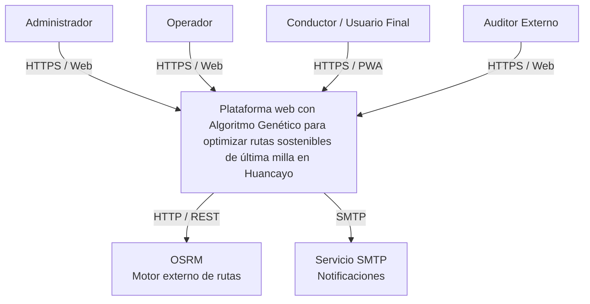
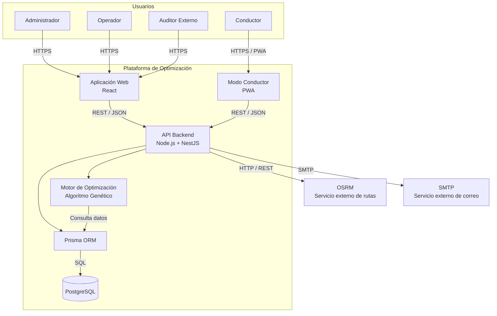
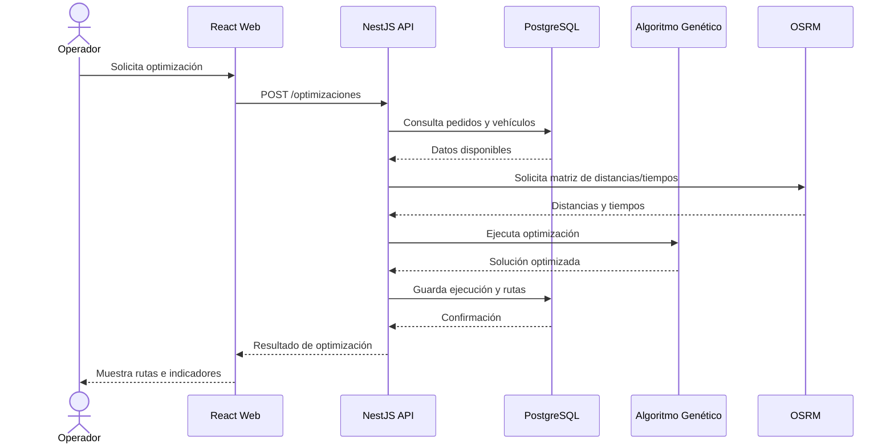
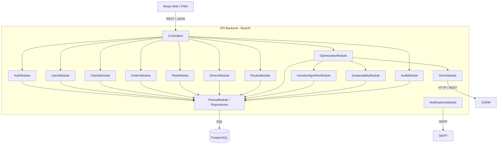
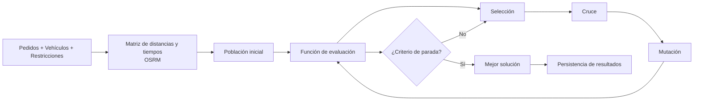
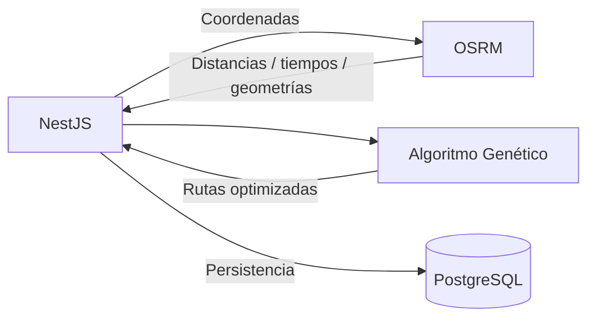
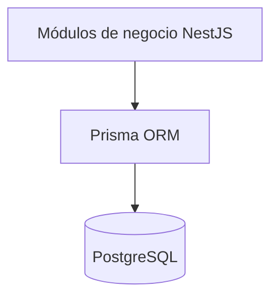
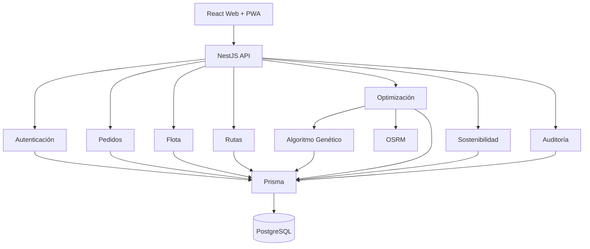

# 12. Modelo C4 V_1_0_0

## 1. Metadatos

| Campo | Información |
|---|---|
| **Nombre del Proyecto** | Plataforma web con Algoritmo Genético para optimizar rutas sostenibles de última milla en Huancayo |
| **Integrantes** | FLORES, TORIBIO, RICARDO MIGUEL; JANAMPA, NAVARRO, CLINTON; RUPAY, CHIRA, ROSALYN EXKRA; ALBORNOZ, QUILIANO, JOSE ANTONIO |
| **Documento** | Modelo C4 |
| **Versión** | V_1_0_0 |
| **Ruta** | `docs/01 Inicio/12. Modelo C4 V_1_0_0.md` |
| **Arquitectura base** | Aplicación web responsive + PWA para conductor |
| **Backend** | Node.js + NestJS |
| **Frontend** | React |
| **Base de datos** | PostgreSQL + Prisma |
| **Motor de rutas** | OSRM |
| **Optimización** | Algoritmo Genético |
| **Comunicación** | REST/JSON sobre HTTPS |

---

# 2. Propósito del Modelo C4

El Modelo C4 representa la arquitectura del software mediante tres niveles:

1. **Nivel 1 — Contexto:** muestra el sistema, sus usuarios y los sistemas externos con los que interactúa.
2. **Nivel 2 — Contenedores:** muestra las principales aplicaciones, servicios y almacenes de datos que conforman la solución.
3. **Nivel 3 — Componentes:** descompone el contenedor backend en módulos internos responsables de autenticación, pedidos, flota, rutas, optimización, integración con OSRM, auditoría y persistencia.

La arquitectura se mantiene alineada con la solución definida para el proyecto: una plataforma web responsive con un modo conductor tipo PWA, backend en NestJS, frontend en React, PostgreSQL como base de datos, Prisma como ORM, OSRM para cálculo de rutas y un Algoritmo Genético para la optimización.

---

# 3. Nivel 1 — Diagrama de Contexto

## 3.1. Descripción

El sistema central es la **Plataforma web de optimización de rutas sostenibles de última milla en Huancayo**.

Los actores principales son:

- **Administrador:** configura parámetros y administra información del sistema.
- **Operador:** registra pedidos, administra vehículos y conductores y ejecuta/consulta optimizaciones.
- **Conductor / Usuario Final:** consulta la ruta asignada y registra eventos de ejecución desde el modo PWA.
- **Auditor Externo:** consulta información de auditoría en modo lectura.

Los sistemas externos principales son:

- **OSRM:** proporciona información de rutas, distancias y tiempos sobre la red vial.
- **Servicio de correo SMTP:** permite enviar notificaciones cuando el sistema lo requiera.



## 3.2. Relaciones del contexto

| Origen | Destino | Comunicación | Propósito |
|---|---|---|---|
| Administrador | Plataforma | HTTPS | Gestionar configuración y administración |
| Operador | Plataforma | HTTPS | Gestionar pedidos, flota, conductores y optimizaciones |
| Conductor | Plataforma | HTTPS/PWA | Consultar rutas y registrar eventos de ejecución |
| Auditor Externo | Plataforma | HTTPS | Consultar registros de auditoría |
| Plataforma | OSRM | HTTP/REST | Obtener distancias, tiempos y geometrías de rutas |
| Plataforma | SMTP | SMTP | Enviar notificaciones del sistema |

---

# 4. Nivel 2 — Diagrama de Contenedores

## 4.1. Contenedores de la solución

La plataforma se divide en los siguientes contenedores:

### 4.1.1. Aplicación Web React

Interfaz utilizada por administradores, operadores y auditores.

Responsabilidades principales:

- Autenticación mediante la API.
- Gestión de pedidos.
- Gestión de vehículos.
- Gestión de conductores.
- Configuración de parámetros.
- Ejecución y consulta de optimizaciones.
- Visualización de rutas.
- Consulta de indicadores de sostenibilidad.
- Consulta de auditoría.

### 4.1.2. Aplicación PWA para Conductor

Corresponde al modo conductor de la solución web.

Responsabilidades principales:

- Consultar la ruta asignada.
- Consultar las paradas.
- Registrar eventos durante la ejecución.
- Registrar incidencias que puedan requerir reoptimización.
- Continuar utilizando determinadas funciones cuando exista conectividad intermitente mediante capacidades PWA.

La PWA consume la misma API backend y no constituye un backend independiente.

### 4.1.3. API Backend NestJS

Es el núcleo de negocio de la plataforma.

Responsabilidades:

- Autenticación y autorización.
- Gestión de usuarios.
- Gestión de pedidos.
- Gestión de clientes.
- Gestión de vehículos.
- Gestión de conductores.
- Gestión de rutas.
- Ejecución del Algoritmo Genético.
- Integración con OSRM.
- Cálculo y almacenamiento de indicadores.
- Registro de auditoría.

### 4.1.4. PostgreSQL

Almacén relacional principal.

Conserva:

- Usuarios y roles.
- Clientes.
- Pedidos.
- Vehículos.
- Conductores.
- Ejecuciones de optimización.
- Rutas.
- Paradas.
- Eventos.
- Indicadores de sostenibilidad.
- Registros de auditoría.

### 4.1.5. Prisma

Capa de acceso a datos utilizada por el backend NestJS para comunicarse con PostgreSQL.

### 4.1.6. Servicio OSRM

Servicio externo utilizado para obtener información de la red vial:

- Distancias.
- Tiempos estimados.
- Geometrías de las rutas.

### 4.1.7. Servicio SMTP

Servicio externo utilizado para el envío de notificaciones por correo electrónico cuando corresponda.

## 4.2. Diagrama de contenedores



---

# 5. Flujo arquitectónico principal

El funcionamiento general para generar una ruta optimizada es:



---

# 6. Nivel 3 — Diagrama de Componentes

## 6.1. Componentes internos del Backend NestJS

El backend se organiza por responsabilidades de negocio y componentes transversales.

### Módulos principales

| Componente | Responsabilidad |
|---|---|
| `AuthModule` | Autenticación y control de acceso |
| `UsersModule` | Gestión de usuarios y roles |
| `ClientsModule` | Gestión de clientes y ubicaciones |
| `OrdersModule` | Gestión de pedidos |
| `FleetModule` | Gestión de vehículos |
| `DriversModule` | Gestión de conductores |
| `RoutesModule` | Gestión de rutas y paradas |
| `OptimizationModule` | Orquestación del proceso de optimización |
| `GeneticAlgorithmModule` | Ejecución del Algoritmo Genético |
| `OsrmModule` | Comunicación con OSRM |
| `SustainabilityModule` | Cálculo y gestión de indicadores de sostenibilidad |
| `AuditModule` | Registro de operaciones y eventos de auditoría |
| `NotificationsModule` | Envío de notificaciones |
| `PrismaModule` | Acceso centralizado a PostgreSQL |

## 6.2. Arquitectura interna



---

# 7. Componentes transversales

## 7.1. Autenticación y autorización

El backend implementará autenticación y autorización mediante componentes de NestJS.

El control de acceso deberá considerar los roles definidos:

- Administrador.
- Operador.
- Usuario Final / Conductor.
- Auditor Externo.

La autorización deberá impedir que un usuario ejecute operaciones que no correspondan a sus permisos.

## 7.2. Validación

Los datos recibidos por la API serán validados antes de ejecutar operaciones de negocio.

La validación se aplicará especialmente a:

- Pedidos.
- Coordenadas.
- Pesos y volúmenes.
- Ventanas horarias.
- Vehículos.
- Conductores.
- Parámetros de optimización.

## 7.3. Auditoría

Las operaciones relevantes generarán registros de auditoría.

El registro considera como mínimo:

- Usuario.
- Entidad afectada.
- Identificador de entidad.
- Acción.
- Detalle.
- IP de origen cuando esté disponible.
- Fecha y hora.

---

# 8. Arquitectura del Algoritmo Genético

El Algoritmo Genético será un componente del backend y no una aplicación independiente para el usuario.



La función de evaluación deberá considerar las restricciones y objetivos definidos para el proyecto, incluyendo los aspectos relacionados con distancia, tiempo, cumplimiento de ventanas y sostenibilidad.

---

# 9. Integración con OSRM

OSRM será tratado como un servicio externo.

La aplicación no almacenará dentro de OSRM la información de negocio. El backend utilizará sus respuestas para construir la información necesaria para la optimización.

Flujo:



---

# 10. Arquitectura de persistencia

La persistencia utiliza PostgreSQL mediante Prisma.



Las entidades principales consideradas son:

```text
roles
usuarios
conductores
vehiculos
clientes
preferencias_cliente
pedidos
ejecuciones_optimizacion
rutas
paradas_ruta
eventos_ruta
indicadores_sostenibilidad
registros_auditoria
```

---

# 11. Principios arquitectónicos adoptados

## 11.1. Separación de responsabilidades

La interfaz, lógica de negocio, optimización y persistencia estarán separadas.

```text
React / PWA
     ↓
REST API
     ↓
NestJS
     ↓
Servicios de negocio
     ↓
Prisma
     ↓
PostgreSQL
```

## 11.2. Integración mediante API

El frontend no accederá directamente a PostgreSQL.

La comunicación seguirá:

```text
Frontend → API NestJS → Prisma → PostgreSQL
```

## 11.3. Servicios externos desacoplados

OSRM y SMTP serán tratados como dependencias externas mediante componentes específicos.

Esto permitirá sustituirlos posteriormente sin modificar directamente todos los módulos de negocio.

## 11.4. Optimización desacoplada

El Algoritmo Genético estará separado de los controladores HTTP.

Los controladores reciben solicitudes y los servicios de aplicación coordinan la ejecución.

## 11.5. Arquitectura preparada para PWA

El modo conductor utiliza la misma API y lógica de negocio que la aplicación web.

No se crea una segunda plataforma backend para conductores.

---

# 12. Mapa de dependencias



---

# 13. Trazabilidad entre arquitectura y requisitos

| Elemento arquitectónico | Requisitos / necesidades relacionadas |
|---|---|
| React Web | Gestión de información, consulta de rutas, reportes y administración |
| PWA Conductor | Consulta de rutas y registro de eventos durante la ejecución |
| NestJS API | Requisitos funcionales de negocio y control de acceso |
| PostgreSQL | Persistencia de usuarios, clientes, pedidos, flota, rutas y auditoría |
| Prisma | Acceso estructurado a la base de datos |
| Algoritmo Genético | Optimización de rutas |
| OSRM | Cálculo de distancias, tiempos y rutas sobre la red vial |
| SustainabilityModule | Indicadores de sostenibilidad |
| AuditModule | Trazabilidad de operaciones |
| AuthModule | Seguridad y control de acceso |
| NotificationsModule | Comunicación de notificaciones |

---

# 14. Decisiones arquitectónicas

| Decisión | Justificación |
|---|---|
| React | Permite desarrollar la interfaz web y reutilizar conceptos para el modo PWA |
| NestJS | Proporciona una estructura modular para organizar el backend y sus responsabilidades |
| PostgreSQL | Se ajusta al modelo relacional del dominio y sus relaciones entre entidades |
| Prisma | Facilita el acceso tipado y estructurado a PostgreSQL desde Node.js |
| OSRM | Permite obtener información de rutas sin implementar un motor cartográfico propio |
| Algoritmo Genético | Permite abordar la optimización combinatoria de las rutas |
| PWA | Permite disponer de un modo conductor accesible desde navegador con capacidades instalables y de soporte ante conectividad intermitente |
| REST/JSON | Define una comunicación sencilla entre frontend y backend |
| HTTPS | Protege la comunicación entre clientes y API |

---

# 15. Alcance arquitectónico de la versión V_1_0_0

Esta arquitectura representa la línea base inicial del proyecto.

En esta versión se consideran:

- Plataforma web responsive.
- Modo conductor PWA.
- Backend Node.js + NestJS.
- Frontend React.
- PostgreSQL.
- Prisma ORM.
- Algoritmo Genético.
- Integración con OSRM.
- Gestión de pedidos.
- Gestión de clientes.
- Gestión de vehículos.
- Gestión de conductores.
- Gestión de rutas.
- Indicadores de sostenibilidad.
- Auditoría.
- Control de acceso por roles.

No se considera como componente obligatorio independiente un microservicio separado para cada módulo. La solución inicial utilizará un **backend modular en NestJS**, apropiado para el alcance y nivel de desarrollo del proyecto.

---

# 16. Siguiente artefacto recomendado

Después del Modelo C4, el siguiente trabajo recomendado es documentar la **arquitectura física/de despliegue**, especificando:

- Navegador / dispositivo del usuario.
- Hosting de frontend.
- Hosting del backend.
- PostgreSQL.
- Comunicación HTTPS.
- Servicio OSRM.
- Servicio SMTP.
- Variables de entorno.
- Configuración de producción.
- Separación entre desarrollo y producción.

**Archivo recomendado:**

`docs/01 Inicio/13. Modelo de Despliegue V_1_0_0.md`
