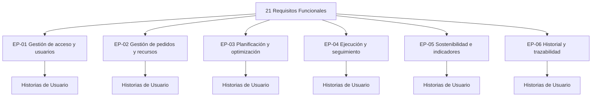
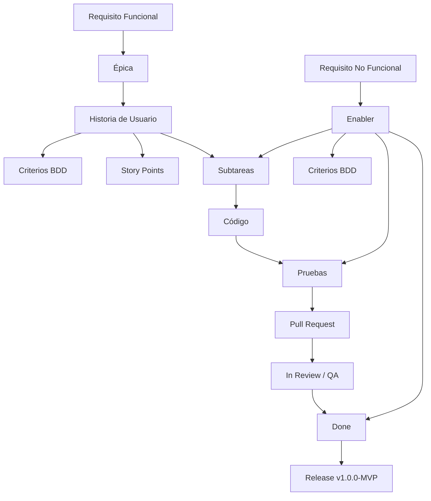

# 01. Transformando a ágil V_1_0_0

## 1. Datos del documento

| Campo | Información |
|---|---|
| **Proyecto** | Plataforma web con Algoritmo Genético para optimizar rutas sostenibles de última milla en Huancayo |
| **Producto** | EcoLogística Huancayo |
| **Ubicación** | Huancayo, Perú |
| **Documento** | Transformación de Requisitos Funcionales y No Funcionales a elementos de trabajo ágiles |
| **Versión** | V_1_0_0 |
| **Fecha** | 2026-09-11 |
| **Enfoque de gestión** | Híbrido |
| **Equipo** | Flores, Toribio, Ricardo Miguel; Janampa, Navarro, Clinton; Rupay, Chira, Rosalyn Exkra; Albornoz, Quiliano, Jose Antonio |

> **Fuente oficial de transformación:** `06. Requisitos funcionales V_1_0_0.md` y `07. Requisitos no funcionales V_1_0_0.md`.
>
> Esta transformación conserva la línea base de **21 requisitos funcionales (RF-001 a RF-021)** y **12 requisitos no funcionales (RNF-001 a RNF-012)**. No se modifican los umbrales ni el contenido de los requisitos fuente.

---

# 2. Propósito del artefacto

El presente documento transforma la línea base de requisitos del producto **EcoLogística Huancayo** en elementos de trabajo ágiles que puedan ser gestionados mediante un backlog y posteriormente configurados en Jira Software.

La transformación sigue la siguiente jerarquía:

```text
REQUISITOS FUNCIONALES
        ↓
     ÉPICAS
        ↓
HISTORIAS DE USUARIO
        ↓
    SUBTAREAS

REQUISITOS NO FUNCIONALES
        ↓
HISTORIAS TÉCNICAS / ENABLERS
        ↓
    SUBTAREAS
```

Los requisitos funcionales se expresan desde el valor esperado por los actores del sistema mediante la estructura **Como / quiero / para**.

Los requisitos no funcionales se transforman principalmente en **Enablers técnicos**, manteniendo sus métricas y umbrales originales. Los aspectos transversales de calidad también se incorporan al **Definition of Done (DoD)**.

---

# 3. Metodología de transformación

## 3.1. Criterios utilizados

Para cada requisito funcional se evaluó:

1. Si representa una capacidad de usuario identificable.
2. Si puede validarse mediante escenarios BDD.
3. Si puede entregar valor verificable.
4. Si su tamaño permite gestionarlo dentro de un Sprint.
5. Si contiene varias acciones que conviene separar en historias.
6. Si mantiene trazabilidad directa con el RF de origen.

Para cada requisito no funcional se evaluó:

1. Si requiere trabajo técnico específico.
2. Si afecta arquitectura, seguridad, rendimiento, infraestructura, calidad o documentación.
3. Si debe mantenerse como Enabler.
4. Si parte de su cumplimiento debe incorporarse transversalmente al DoD.

## 3.2. Regla de conservación de la línea base

La transformación ágil **no redefine los requisitos**.

```text
RF/RNF fuente
     ↓
Interpretación para gestión ágil
     ↓
Épica / US / Enabler
```

La métrica del RNF sigue siendo la establecida en el documento fuente. Por ejemplo:

- RNF-001: ≤ 45 segundos.
- RNF-002: < 30 segundos.
- RNF-003: 0 vulnerabilidades críticas y 0 altas abiertas antes de producción.
- RNF-006: ≥ 80 % de tareas completadas correctamente.
- RNF-008: 1,000 pedidos diarios y 50 vehículos.
- RNF-009: ≥ 99.5 % durante el horario operativo.
- RNF-012: 100 % de documentos técnicos obligatorios.

---

# 4. Mapa de Épicas

Se establecen seis épicas para evitar convertir cada requisito en una épica independiente.

| ID | Épica | Propósito | RF relacionados |
|---|---|---|---|
| **EP-01** | Gestión de acceso y usuarios | Administrar autenticación, usuarios y roles. | RF-001, RF-002 |
| **EP-02** | Gestión de pedidos y recursos | Administrar pedidos, vehículos, conductores y disponibilidad. | RF-003, RF-004, RF-005, RF-006, RF-007 |
| **EP-03** | Planificación y optimización de rutas | Preparar planificaciones, generar alternativas y optimizarlas. | RF-008, RF-009, RF-010, RF-018 |
| **EP-04** | Ejecución y seguimiento de entregas | Consultar, asignar y ejecutar rutas y registrar incidencias. | RF-011, RF-012, RF-013, RF-014, RF-015, RF-016, RF-019 |
| **EP-05** | Sostenibilidad e indicadores | Registrar información ambiental y consultar indicadores. | RF-017, RF-020 |
| **EP-06** | Historial y trazabilidad | Consultar operaciones históricas del sistema. | RF-021 |



---

# 5. Transformación de Requisitos Funcionales a Historias de Usuario

## EP-01 — Gestión de acceso y usuarios

### US-001: Iniciar sesión

**ID:** US-001  
**Título:** Iniciar sesión con credenciales válidas  
**Épica Relacionada:** EP-01 Gestión de acceso y usuarios  
**RF relacionado:** RF-001  
**Prioridad:** Alta  
**Story Points:** 3

**Redacción:**

> Como **usuario registrado y habilitado**,  
> quiero **iniciar sesión mediante mis credenciales**,  
> para **acceder a las funciones correspondientes a mi rol**.

### Criterios de Aceptación

#### Escenario 1: Inicio de sesión válido

**Dado** un usuario registrado y habilitado con credenciales válidas

**Cuando** ingresa sus credenciales y solicita iniciar sesión

**Entonces** el sistema debe validar la información y permitir el acceso a las funciones correspondientes a su rol.

#### Escenario 2: Credenciales inválidas

**Dado** un usuario registrado

**Cuando** proporciona credenciales inválidas

**Entonces** el sistema debe denegar el acceso y mostrar un mensaje explícito indicando que las credenciales no son válidas.

---

### US-002: Cerrar sesión

**ID:** US-002  
**Título:** Finalizar sesión  
**Épica Relacionada:** EP-01 Gestión de acceso y usuarios  
**RF relacionado:** RF-001  
**Prioridad:** Alta  
**Story Points:** 2

**Redacción:**

> Como **usuario autenticado**,  
> quiero **cerrar mi sesión**,  
> para **finalizar el acceso a las funciones protegidas**.

### Criterios de Aceptación

#### Escenario 1: Cierre normal

**Dado** un usuario con una sesión activa

**Cuando** solicita cerrar sesión

**Entonces** el sistema debe finalizar la sesión y restringir el acceso a las funciones protegidas.

#### Escenario 2: Acceso posterior al cierre

**Dado** un usuario que cerró su sesión

**Cuando** intenta acceder a una función protegida

**Entonces** el sistema debe solicitar nuevamente la autenticación.

---

### US-003: Administrar usuarios y roles

**ID:** US-003  
**Título:** Administrar usuarios y asignación de roles  
**Épica Relacionada:** EP-01 Gestión de acceso y usuarios  
**RF relacionado:** RF-002  
**Prioridad:** Alta  
**Story Points:** 8

**Redacción:**

> Como **Administrador**,  
> quiero **registrar, consultar, modificar, habilitar, deshabilitar usuarios y asignarles roles permitidos**,  
> para **administrar el acceso a las funciones del sistema**.

### Criterios de Aceptación

#### Escenario 1: Registrar usuario

**Dado** un administrador autenticado con permisos de gestión

**Cuando** registra un usuario con datos válidos y asigna un rol permitido

**Entonces** el sistema debe crear el usuario y confirmar la operación.

#### Escenario 2: Modificar usuario

**Dado** un usuario existente

**Cuando** el administrador modifica sus datos o cambia su estado

**Entonces** el sistema debe actualizar la información y confirmar el cambio.

#### Escenario 3: Datos no válidos

**Dado** un administrador que intenta registrar información obligatoria incompleta o un rol no permitido

**Cuando** confirma la operación

**Entonces** el sistema debe rechazar el registro y mostrar los datos que deben corregirse.

---

# EP-02 — Gestión de pedidos y recursos

### US-004: Registrar pedidos

**ID:** US-004  
**Título:** Registrar pedidos de entrega  
**Épica Relacionada:** EP-02 Gestión de pedidos y recursos  
**RF relacionado:** RF-003  
**Prioridad:** Alta  
**Story Points:** 5

**Redacción:**

> Como **Planificador logístico**,  
> quiero **registrar un pedido de entrega con los datos requeridos**,  
> para **incorporarlo al proceso de planificación**.

### Criterios de Aceptación

#### Escenario 1: Registro válido

**Dado** un planificador autenticado y un pedido con información válida

**Cuando** registra el pedido

**Entonces** el sistema debe almacenar el pedido y confirmar su registro.

#### Escenario 2: Datos incompletos

**Dado** un pedido con datos obligatorios incompletos

**Cuando** el planificador intenta registrarlo

**Entonces** el sistema debe rechazar la operación y señalar los datos que deben corregirse.

---

### US-005: Consultar pedidos

**ID:** US-005  
**Título:** Consultar pedidos registrados  
**Épica Relacionada:** EP-02 Gestión de pedidos y recursos  
**RF relacionado:** RF-004  
**Prioridad:** Alta  
**Story Points:** 3

**Redacción:**

> Como **Planificador o Supervisor**,  
> quiero **consultar pedidos registrados y aplicar criterios de búsqueda permitidos**,  
> para **conocer su información y estado**.

### Criterios de Aceptación

#### Escenario 1: Consulta

**Dado** un usuario autorizado y pedidos registrados

**Cuando** consulta el listado de pedidos

**Entonces** el sistema debe mostrar la información correspondiente.

#### Escenario 2: Búsqueda

**Dado** un usuario autorizado que necesita localizar pedidos

**Cuando** aplica criterios de búsqueda permitidos

**Entonces** el sistema debe mostrar los pedidos que coinciden con los criterios.

---

### US-006: Actualizar estado de pedido

**ID:** US-006  
**Título:** Actualizar estado de un pedido  
**Épica Relacionada:** EP-02 Gestión de pedidos y recursos  
**RF relacionado:** RF-004  
**Prioridad:** Alta  
**Story Points:** 3

**Redacción:**

> Como **usuario autorizado**,  
> quiero **actualizar el estado de un pedido mediante una transición permitida**,  
> para **mantener actualizado su ciclo operativo**.

### Criterios de Aceptación

#### Escenario 1: Transición permitida

**Dado** un pedido registrado

**Cuando** el usuario ejecuta una transición de estado permitida

**Entonces** el sistema debe guardar el nuevo estado y confirmarlo.

#### Escenario 2: Transición no permitida

**Dado** un pedido registrado

**Cuando** el usuario intenta ejecutar una transición no permitida

**Entonces** el sistema debe denegar la operación y conservar el estado anterior.

---

### US-007: Gestionar vehículos

**ID:** US-007  
**Título:** Gestionar vehículos de la operación  
**Épica Relacionada:** EP-02 Gestión de pedidos y recursos  
**RF relacionado:** RF-005  
**Prioridad:** Alta  
**Story Points:** 5

**Redacción:**

> Como **Planificador logístico**,  
> quiero **registrar, consultar, modificar y cambiar el estado operativo de los vehículos**,  
> para **disponer de información actualizada de los recursos disponibles**.

### Criterios de Aceptación

#### Escenario 1: Registrar vehículo

**Dado** un usuario autorizado y datos válidos de un vehículo

**Cuando** registra el vehículo

**Entonces** el sistema debe almacenar la información y confirmar el registro.

#### Escenario 2: Actualizar vehículo

**Dado** un vehículo registrado

**Cuando** el usuario modifica sus datos o estado operativo

**Entonces** el sistema debe actualizar la información y confirmar la operación.

---

### US-008: Gestionar conductores

**ID:** US-008  
**Título:** Gestionar conductores de la operación  
**Épica Relacionada:** EP-02 Gestión de pedidos y recursos  
**RF relacionado:** RF-006  
**Prioridad:** Alta  
**Story Points:** 5

**Redacción:**

> Como **Planificador logístico**,  
> quiero **registrar, consultar, modificar y cambiar el estado de los conductores**,  
> para **administrar los recursos humanos disponibles para las entregas**.

### Criterios de Aceptación

#### Escenario 1: Registrar conductor

**Dado** un usuario autorizado y datos válidos de un conductor

**Cuando** registra al conductor

**Entonces** el sistema debe almacenar su información y confirmar el registro.

#### Escenario 2: Actualizar estado

**Dado** un conductor registrado

**Cuando** el usuario autorizado actualiza sus datos o estado

**Entonces** el sistema debe conservar los cambios y confirmar la actualización.

---

### US-009: Registrar disponibilidad operativa

**ID:** US-009  
**Título:** Registrar disponibilidad de vehículos y conductores  
**Épica Relacionada:** EP-02 Gestión de pedidos y recursos  
**RF relacionado:** RF-007  
**Prioridad:** Alta  
**Story Points:** 5

**Redacción:**

> Como **Planificador logístico**,  
> quiero **registrar y modificar la disponibilidad de vehículos y conductores**,  
> para **utilizar únicamente los recursos disponibles en una planificación**.

### Criterios de Aceptación

#### Escenario 1: Registrar disponibilidad

**Dado** un planificador autenticado y recursos registrados

**Cuando** registra la disponibilidad para una jornada

**Entonces** el sistema debe almacenar la disponibilidad y dejarla disponible para la planificación.

#### Escenario 2: Modificar disponibilidad

**Dado** una disponibilidad previamente registrada

**Cuando** el planificador la modifica antes de iniciar la planificación

**Entonces** el sistema debe actualizar la disponibilidad.

---

# EP-03 — Planificación y optimización de rutas

### US-010: Preparar planificación

**ID:** US-010  
**Título:** Preparar una planificación de rutas  
**Épica Relacionada:** EP-03 Planificación y optimización de rutas  
**RF relacionado:** RF-008  
**Prioridad:** Alta  
**Story Points:** 5

**Redacción:**

> Como **Planificador logístico**,  
> quiero **seleccionar pedidos pendientes y recursos disponibles para una planificación**,  
> para **preparar los datos necesarios para generar rutas**.

### Criterios de Aceptación

#### Escenario 1: Preparación válida

**Dado** un planificador autorizado, pedidos pendientes y recursos disponibles

**Cuando** selecciona los elementos para la planificación

**Entonces** el sistema debe crear una planificación en estado preparado.

#### Escenario 2: Sin recursos

**Dado** una selección sin pedidos o recursos necesarios

**Cuando** el planificador intenta preparar la planificación

**Entonces** el sistema debe rechazar la operación e indicar la condición que impide continuar.

---

### US-011: Generar alternativas

**ID:** US-011  
**Título:** Generar alternativas de rutas  
**Épica Relacionada:** EP-03 Planificación y optimización de rutas  
**RF relacionado:** RF-009  
**Prioridad:** Alta  
**Story Points:** 8

**Redacción:**

> Como **Planificador logístico**,  
> quiero **generar alternativas de rutas para una planificación preparada**,  
> para **disponer de diferentes soluciones de recorrido para su evaluación**.

### Criterios de Aceptación

#### Escenario 1: Generación válida

**Dado** una planificación preparada con pedidos y recursos válidos

**Cuando** el planificador solicita generar alternativas

**Entonces** el sistema debe generar las alternativas de rutas correspondientes.

#### Escenario 2: Planificación inválida

**Dado** una planificación que no cumple las condiciones necesarias

**Cuando** el planificador solicita generar alternativas

**Entonces** el sistema debe impedir la operación e indicar la condición que debe corregirse.

---

### US-012: Optimizar rutas

**ID:** US-012  
**Título:** Optimizar rutas según criterios definidos  
**Épica Relacionada:** EP-03 Planificación y optimización de rutas  
**RF relacionado:** RF-010  
**Prioridad:** Alta  
**Story Points:** 13

**Redacción:**

> Como **Planificador logístico**,  
> quiero **optimizar las alternativas de rutas según los criterios definidos**,  
> para **obtener una solución de planificación que pueda ser evaluada y utilizada en la operación**.

### Criterios de Aceptación

#### Escenario 1: Optimización válida

**Dado** una planificación con datos válidos

**Cuando** el planificador solicita la optimización

**Entonces** el sistema debe procesar las alternativas y presentar una solución de rutas.

#### Escenario 2: Interrupción del proceso

**Dado** una ejecución de optimización en curso

**Cuando** se produce una interrupción o error controlado

**Entonces** el sistema debe conservar los datos de la planificación y comunicar el resultado del proceso.

---

### US-013: Consultar información de rutas

**ID:** US-013  
**Título:** Consultar información de las rutas  
**Épica Relacionada:** EP-04 Ejecución y seguimiento de entregas  
**RF relacionado:** RF-011  
**Prioridad:** Alta  
**Story Points:** 5

**Redacción:**

> Como **Planificador o Supervisor**,  
> quiero **consultar la información de una ruta generada**,  
> para **revisar su recorrido, pedidos y datos operativos**.

### Criterios de Aceptación

#### Escenario 1: Consulta de ruta

**Dado** una ruta generada y un usuario autorizado

**Cuando** consulta la ruta

**Entonces** el sistema debe mostrar la información disponible de la ruta.

#### Escenario 2: Ruta inexistente

**Dado** un identificador de ruta que no corresponde a una ruta registrada

**Cuando** el usuario intenta consultarla

**Entonces** el sistema debe informar que la ruta no existe.

---

### US-014: Comparar alternativas

**ID:** US-014  
**Título:** Comparar alternativas de planificación  
**Épica Relacionada:** EP-03 Planificación y optimización de rutas  
**RF relacionado:** RF-018  
**Prioridad:** Alta  
**Story Points:** 5

**Redacción:**

> Como **Planificador logístico**,  
> quiero **comparar alternativas de planificación mediante sus indicadores disponibles**,  
> para **seleccionar una alternativa para la operación**.

### Criterios de Aceptación

#### Escenario 1: Comparación

**Dado** dos o más alternativas disponibles

**Cuando** el planificador solicita compararlas

**Entonces** el sistema debe mostrar los datos disponibles de cada alternativa para su comparación.

#### Escenario 2: Una sola alternativa

**Dado** una planificación con una sola alternativa

**Cuando** el planificador solicita una comparación

**Entonces** el sistema debe informar que no existen múltiples alternativas para comparar.

---

# EP-04 — Ejecución y seguimiento de entregas

### US-015: Asignar rutas

**ID:** US-015  
**Título:** Asignar rutas a conductores  
**Épica Relacionada:** EP-04 Ejecución y seguimiento de entregas  
**RF relacionado:** RF-012  
**Prioridad:** Alta  
**Story Points:** 5

**Redacción:**

> Como **Planificador logístico**,  
> quiero **asignar una ruta a un conductor disponible**,  
> para **preparar su ejecución**.

### Criterios de Aceptación

#### Escenario 1: Asignación válida

**Dado** una ruta confirmable y un conductor disponible

**Cuando** el planificador asigna la ruta

**Entonces** el sistema debe registrar la asignación y mostrarla asociada al conductor.

#### Escenario 2: Conductor no disponible

**Dado** un conductor que no se encuentra disponible

**Cuando** el planificador intenta asignarle la ruta

**Entonces** el sistema debe rechazar la asignación e indicar la condición correspondiente.

---

### US-016: Consultar ruta asignada

**ID:** US-016  
**Título:** Consultar ruta asignada por el conductor  
**Épica Relacionada:** EP-04 Ejecución y seguimiento de entregas  
**RF relacionado:** RF-013  
**Prioridad:** Alta  
**Story Points:** 3

**Redacción:**

> Como **Conductor**,  
> quiero **consultar la ruta que tengo asignada**,  
> para **conocer las entregas que debo ejecutar**.

### Criterios de Aceptación

#### Escenario 1: Ruta asignada

**Dado** un conductor autenticado con una ruta asignada

**Cuando** consulta su ruta

**Entonces** el sistema debe mostrar la información correspondiente.

#### Escenario 2: Sin ruta asignada

**Dado** un conductor autenticado sin ruta asignada

**Cuando** consulta sus rutas

**Entonces** el sistema debe informar que no tiene una ruta disponible.

---

### US-017: Actualizar estado de entrega

**ID:** US-017  
**Título:** Actualizar el estado de una entrega  
**Épica Relacionada:** EP-04 Ejecución y seguimiento de entregas  
**RF relacionado:** RF-014  
**Prioridad:** Alta  
**Story Points:** 5

**Redacción:**

> Como **Conductor**,  
> quiero **actualizar el estado de una entrega**,  
> para **registrar el resultado de la operación**.

### Criterios de Aceptación

#### Escenario 1: Actualización válida

**Dado** un conductor con una entrega asignada

**Cuando** registra un estado de entrega permitido

**Entonces** el sistema debe guardar el estado y actualizar el progreso correspondiente.

#### Escenario 2: Entrega no asignada

**Dado** un conductor que intenta modificar una entrega que no tiene asignada

**Cuando** solicita actualizar su estado

**Entonces** el sistema debe denegar la operación.

---

### US-018: Registrar incidencias

**ID:** US-018  
**Título:** Registrar incidencias de entrega  
**Épica Relacionada:** EP-04 Ejecución y seguimiento de entregas  
**RF relacionado:** RF-015  
**Prioridad:** Alta  
**Story Points:** 5

**Redacción:**

> Como **Conductor**,  
> quiero **registrar una incidencia asociada a una entrega**,  
> para **informar situaciones que afecten su ejecución**.

### Criterios de Aceptación

#### Escenario 1: Registrar incidencia

**Dado** un conductor con una entrega asignada

**Cuando** registra una incidencia con la información requerida

**Entonces** el sistema debe asociarla a la entrega correspondiente.

#### Escenario 2: Información incompleta

**Dado** una incidencia sin la información obligatoria

**Cuando** el conductor intenta registrarla

**Entonces** el sistema debe rechazar el registro y señalar los datos faltantes.

---

### US-019: Consultar estado operativo

**ID:** US-019  
**Título:** Consultar estado de rutas y entregas  
**Épica Relacionada:** EP-04 Ejecución y seguimiento de entregas  
**RF relacionado:** RF-016  
**Prioridad:** Alta  
**Story Points:** 5

**Redacción:**

> Como **Supervisor**,  
> quiero **consultar el estado de las rutas y entregas**,  
> para **dar seguimiento a la operación logística**.

### Criterios de Aceptación

#### Escenario 1: Consulta operativa

**Dado** que existen rutas y entregas registradas

**Cuando** el supervisor consulta el estado operativo

**Entonces** el sistema debe mostrar la información disponible.

#### Escenario 2: Filtrado

**Dado** un conjunto de rutas y entregas

**Cuando** el supervisor aplica un filtro permitido

**Entonces** el sistema debe mostrar únicamente los registros correspondientes al filtro.

---

### US-020: Confirmar ruta

**ID:** US-020  
**Título:** Confirmar una ruta para ejecución  
**Épica Relacionada:** EP-04 Ejecución y seguimiento de entregas  
**RF relacionado:** RF-019  
**Prioridad:** Alta  
**Story Points:** 5

**Redacción:**

> Como **Planificador logístico**,  
> quiero **confirmar una ruta previamente revisada**,  
> para **habilitarla para su ejecución operativa**.

### Criterios de Aceptación

#### Escenario 1: Confirmación válida

**Dado** una ruta generada y revisada

**Cuando** el planificador confirma la ruta

**Entonces** el sistema debe cambiarla al estado correspondiente para su ejecución.

#### Escenario 2: Ruta no preparada

**Dado** una ruta que no cumple las condiciones para confirmación

**Cuando** el planificador intenta confirmarla

**Entonces** el sistema debe impedir la confirmación e indicar la condición pendiente.

---

# EP-05 — Sostenibilidad e indicadores

### US-021: Registrar información de sostenibilidad

**ID:** US-021  
**Título:** Registrar información para evaluar sostenibilidad  
**Épica Relacionada:** EP-05 Sostenibilidad e indicadores  
**RF relacionado:** RF-017  
**Prioridad:** Media  
**Story Points:** 5

**Redacción:**

> Como **Supervisor o Planificador**,  
> quiero **registrar la información necesaria para evaluar la sostenibilidad de una planificación**,  
> para **disponer de datos que permitan analizar sus resultados ambientales**.

### Criterios de Aceptación

#### Escenario 1: Registro

**Dado** una operación o planificación con datos disponibles

**Cuando** el usuario autorizado registra la información requerida

**Entonces** el sistema debe almacenarla asociada a la operación correspondiente.

#### Escenario 2: Información insuficiente

**Dado** información ambiental incompleta

**Cuando** el usuario intenta registrar los datos

**Entonces** el sistema debe rechazar la operación y señalar la información requerida.

---

### US-022: Consultar indicadores

**ID:** US-022  
**Título:** Consultar indicadores de operación  
**Épica Relacionada:** EP-05 Sostenibilidad e indicadores  
**RF relacionado:** RF-020  
**Prioridad:** Media  
**Story Points:** 5

**Redacción:**

> Como **Supervisor**,  
> quiero **consultar indicadores de la operación**,  
> para **evaluar los resultados de las rutas y entregas**.

### Criterios de Aceptación

#### Escenario 1: Consulta

**Dado** que existen datos de operación procesados

**Cuando** el supervisor accede al módulo de indicadores

**Entonces** el sistema debe mostrar los indicadores disponibles.

#### Escenario 2: Filtro temporal

**Dado** indicadores correspondientes a diferentes periodos

**Cuando** el supervisor selecciona un periodo válido

**Entonces** el sistema debe mostrar los indicadores correspondientes al periodo seleccionado.

---

# EP-06 — Historial y trazabilidad

### US-023: Consultar historial

**ID:** US-023  
**Título:** Consultar historial de operaciones  
**Épica Relacionada:** EP-06 Historial y trazabilidad  
**RF relacionado:** RF-021  
**Prioridad:** Media  
**Story Points:** 5

**Redacción:**

> Como **Administrador o Supervisor autorizado**,  
> quiero **consultar el historial de operaciones**,  
> para **revisar información de actividades realizadas anteriormente**.

### Criterios de Aceptación

#### Escenario 1: Consulta histórica

**Dado** que existen operaciones registradas

**Cuando** el usuario autorizado consulta el historial

**Entonces** el sistema debe mostrar los registros disponibles.

#### Escenario 2: Periodo sin registros

**Dado** un periodo sin operaciones registradas

**Cuando** el usuario consulta el historial para dicho periodo

**Entonces** el sistema debe informar que no existen registros para los criterios seleccionados.

---

# 6. Transformación de RNF a Historias Técnicas / Enablers

## EN-001: Rendimiento del algoritmo

**RNF relacionado:** RNF-001  
**Categoría:** Eficiencia de desempeño  
**Prioridad:** Alta  
**Story Points:** 8

**Objetivo técnico:** Implementar y verificar el proceso de optimización para cumplir el umbral de **≤ 45 segundos** con hasta **150 pedidos y 15 vehículos**.

### Criterios de Aceptación

#### Escenario 1: Prueba de rendimiento

**Dado** un conjunto válido de hasta 150 pedidos y 15 vehículos

**Cuando** se ejecuta la optimización

**Entonces** el tiempo de procesamiento medido debe ser ≤ 45 segundos.

#### Escenario 2: Registro de evidencia

**Dado** una prueba válida de optimización

**Cuando** finaliza el proceso

**Entonces** debe registrarse el tiempo obtenido y su cumplimiento respecto al umbral.

---

## EN-002: Re-optimización dinámica

**RNF relacionado:** RNF-002  
**Categoría:** Eficiencia de desempeño  
**Prioridad:** Alta  
**Story Points:** 8

**Objetivo técnico:** Implementar y verificar la re-optimización ante eventos definidos con un tiempo inferior a **30 segundos**.

### Criterios de Aceptación

#### Escenario 1: Re-optimización

**Dado** una planificación vigente y un evento que la modifica

**Cuando** se solicita la re-optimización

**Entonces** el sistema debe generar una solución válida en < 30 segundos.

#### Escenario 2: Evidencia

**Dado** una ejecución de re-optimización

**Cuando** finaliza el proceso

**Entonces** debe registrarse el tiempo obtenido.

---

## EN-003: Seguridad de la plataforma

**RNF relacionado:** RNF-003  
**Categoría:** Seguridad  
**Prioridad:** Alta  
**Story Points:** 8

**Objetivo técnico:** Aplicar controles de seguridad y realizar verificaciones antes de cada liberación a producción.

**Umbral:** **0 vulnerabilidades críticas y 0 vulnerabilidades altas abiertas** relacionadas con OWASP Top 10 antes de producción.

### Criterios de Aceptación

#### Escenario 1: Prueba de seguridad

**Dado** un endpoint protegido

**Cuando** se ejecuta una prueba de seguridad con un patrón de ataque definido

**Entonces** la aplicación debe impedir el acceso no autorizado y conservar la integridad de la información.

#### Escenario 2: Revisión previa a producción

**Dado** una versión candidata a producción

**Cuando** se ejecuta el análisis de seguridad

**Entonces** no deben existir vulnerabilidades críticas ni altas abiertas.

---

## EN-004: Protección de datos personales

**RNF relacionado:** RNF-004  
**Categoría:** Seguridad  
**Prioridad:** Alta  
**Story Points:** 5

**Objetivo técnico:** Implementar controles de autorización para información personal.

**Umbral:** **100 % de las pruebas de autorización** deben impedir accesos no permitidos.

### Criterios de Aceptación

#### Escenario 1: Acceso autorizado

**Dado** un usuario con permisos para consultar determinada información

**Cuando** solicita la información

**Entonces** el sistema debe permitir la operación.

#### Escenario 2: Acceso no autorizado

**Dado** un usuario sin permisos para consultar información personal

**Cuando** intenta acceder

**Entonces** el sistema debe denegar la operación y no revelar la información protegida.

---

## EN-005: Compatibilidad y portabilidad web

**RNF relacionado:** RNF-005  
**Categoría:** Compatibilidad / Portabilidad  
**Prioridad:** Media  
**Story Points:** 5

**Objetivo técnico:** Validar las funciones del MVP en los navegadores y dispositivos definidos para las pruebas.

**Umbral:** **100 % de los casos de prueba funcionales definidos para compatibilidad** deben completarse correctamente en los navegadores y versiones declarados.

### Criterios de Aceptación

#### Escenario 1: Navegador compatible

**Dado** un navegador incluido en la matriz oficial de compatibilidad

**Cuando** el usuario ejecuta una función del MVP

**Entonces** la función debe operar sin errores funcionales atribuibles al navegador.

#### Escenario 2: Registro de resultados

**Dado** una versión del MVP

**Cuando** se ejecuta la matriz de compatibilidad

**Entonces** deben registrarse los resultados de todos los casos definidos.

---

## EN-006: Usabilidad del modo conductor

**RNF relacionado:** RNF-006  
**Categoría:** Usabilidad  
**Prioridad:** Alta  
**Story Points:** 5

**Objetivo técnico:** Validar los flujos críticos del modo conductor.

**Umbral:** Al menos **80 % de los participantes** debe completar correctamente las tareas críticas sin asistencia directa.

### Criterios de Aceptación

#### Escenario 1: Evaluación de tareas

**Dado** un conductor participante

**Cuando** ejecuta las tareas críticas definidas

**Entonces** debe registrarse si completa correctamente cada tarea sin asistencia directa.

#### Escenario 2: Resultado global

**Dado** el conjunto de participantes de la prueba

**Cuando** se consolidan los resultados

**Entonces** al menos el 80 % debe completar correctamente las tareas definidas.

---

## EN-007: Accesibilidad WCAG

**RNF relacionado:** RNF-007  
**Categoría:** Accesibilidad  
**Prioridad:** Alta  
**Story Points:** 5

**Objetivo técnico:** Evaluar y corregir las interfaces del sistema conforme a **WCAG 2.1 nivel AA**.

### Criterios de Aceptación

#### Escenario 1: Evaluación

**Dado** un conjunto de páginas y flujos críticos

**Cuando** se ejecuta una evaluación de accesibilidad

**Entonces** los resultados deben quedar registrados respecto de los criterios WCAG 2.1 AA aplicables.

#### Escenario 2: Corrección

**Dado** un criterio aplicable que presenta incumplimiento

**Cuando** se corrige el componente correspondiente

**Entonces** debe repetirse la evaluación y registrarse el resultado.

---

## EN-008: Capacidad operativa

**RNF relacionado:** RNF-008  
**Categoría:** Capacidad / Escalabilidad  
**Prioridad:** Alta  
**Story Points:** 8

**Objetivo técnico:** Verificar que la plataforma soporte el escenario objetivo de **1,000 pedidos diarios y 50 vehículos**.

### Criterios de Aceptación

#### Escenario 1: Prueba de capacidad

**Dado** un escenario de hasta 1,000 pedidos diarios y 50 vehículos

**Cuando** se ejecutan las operaciones previstas

**Entonces** deben registrarse los resultados de capacidad sin pérdida de datos ni errores funcionales no controlados.

#### Escenario 2: Evidencia

**Dado** que finaliza la prueba de capacidad

**Cuando** se consolidan los resultados

**Entonces** debe quedar evidencia del volumen procesado y de los resultados obtenidos.

---

## EN-009: Disponibilidad del servicio

**RNF relacionado:** RNF-009  
**Categoría:** Fiabilidad  
**Prioridad:** Alta  
**Story Points:** 5

**Objetivo técnico:** Medir y mantener una disponibilidad mínima de **99.5 %** durante el horario operativo de **05:00 a 22:00 horas**.

### Criterios de Aceptación

#### Escenario 1: Medición

**Dado** un periodo de operación programado

**Cuando** se registra el tiempo disponible del servicio

**Entonces** la disponibilidad calculada debe ser ≥ 99.5 %.

#### Escenario 2: Interrupción

**Dado** una interrupción controlada del servicio

**Cuando** se ejecuta el procedimiento de recuperación

**Entonces** debe registrarse el tiempo de recuperación y el efecto sobre la disponibilidad.

---

## EN-010: Mantenibilidad y calidad técnica

**RNF relacionado:** RNF-010  
**Categoría:** Mantenibilidad  
**Prioridad:** Media  
**Story Points:** 5

**Objetivo técnico:** Mantener documentados y probados los módulos clasificados como críticos.

**Umbral:** **100 % de los módulos críticos** documentados, con pruebas asociadas y referencia dentro de la estructura del proyecto antes de la entrega final.

### Criterios de Aceptación

#### Escenario 1: Revisión de módulo

**Dado** un módulo clasificado como crítico

**Cuando** se revisan su código, documentación y pruebas

**Entonces** deben existir los tres elementos definidos.

#### Escenario 2: Actualización

**Dado** una modificación de un módulo crítico

**Cuando** se integra el cambio

**Entonces** debe actualizarse la documentación y las pruebas relacionadas.

---

## EN-011: Eficiencia de recursos y Green Software

**RNF relacionado:** RNF-011  
**Categoría:** Sostenibilidad / Eficiencia de recursos  
**Prioridad:** Media  
**Story Points:** 5

**Objetivo técnico:** Registrar métricas de uso de recursos en los endpoints del MVP.

**Umbral:** **100 % de los endpoints del MVP** deben registrar métricas de tiempo de respuesta y tamaño de respuesta durante las pruebas.

### Criterios de Aceptación

#### Escenario 1: Medición de endpoint

**Dado** un endpoint perteneciente al MVP

**Cuando** se ejecuta su prueba de rendimiento

**Entonces** deben registrarse al menos el tiempo de respuesta, tamaño del payload y resultado de la operación.

#### Escenario 2: Cobertura de medición

**Dado** el conjunto total de endpoints del MVP

**Cuando** se revisan las evidencias de rendimiento

**Entonces** el 100 % debe contar con las métricas definidas.

---

## EN-012: Documentación y trazabilidad

**RNF relacionado:** RNF-012  
**Categoría:** Documentación / Mantenibilidad  
**Prioridad:** Alta  
**Story Points:** 3

**Objetivo técnico:** Mantener disponible, versionada y trazable la documentación técnica obligatoria.

**Umbral:** **100 % de los documentos técnicos obligatorios** disponibles antes de la entrega final.

### Criterios de Aceptación

#### Escenario 1: Documentación obligatoria

**Dado** el repositorio correspondiente a una versión entregable

**Cuando** se verifica la documentación técnica

**Entonces** el 100 % de los documentos obligatorios definidos debe estar disponible y versionado.

#### Escenario 2: Cambio técnico

**Dado** un cambio que afecta documentación técnica

**Cuando** se integra el cambio

**Entonces** la documentación correspondiente debe actualizarse y conservar su trazabilidad.

---

# 7. Matriz de trazabilidad RF → Épica → Historia

| RF | Épica | Historias |
|---|---|---|
| RF-001 | EP-01 | US-001, US-002 |
| RF-002 | EP-01 | US-003 |
| RF-003 | EP-02 | US-004 |
| RF-004 | EP-02 | US-005, US-006 |
| RF-005 | EP-02 | US-007 |
| RF-006 | EP-02 | US-008 |
| RF-007 | EP-02 | US-009 |
| RF-008 | EP-03 | US-010 |
| RF-009 | EP-03 | US-011 |
| RF-010 | EP-03 | US-012 |
| RF-011 | EP-04 | US-013 |
| RF-012 | EP-04 | US-015 |
| RF-013 | EP-04 | US-016 |
| RF-014 | EP-04 | US-017 |
| RF-015 | EP-04 | US-018 |
| RF-016 | EP-04 | US-019 |
| RF-017 | EP-05 | US-021 |
| RF-018 | EP-03 | US-014 |
| RF-019 | EP-04 | US-020 |
| RF-020 | EP-05 | US-022 |
| RF-021 | EP-06 | US-023 |

> **Resultado:** los 21 RF quedan cubiertos y trazables. Algunos RF fueron divididos en historias independientes cuando contenían más de una capacidad funcional, sin alterar el requisito fuente.

---

# 8. Matriz de trazabilidad RNF → Enabler

| RNF | Enabler | Tipo de trabajo |
|---|---|---|
| RNF-001 | EN-001 | Rendimiento |
| RNF-002 | EN-002 | Rendimiento / re-optimización |
| RNF-003 | EN-003 | Seguridad |
| RNF-004 | EN-004 | Seguridad / autorización |
| RNF-005 | EN-005 | Compatibilidad |
| RNF-006 | EN-006 | Usabilidad |
| RNF-007 | EN-007 | Accesibilidad |
| RNF-008 | EN-008 | Capacidad / escalabilidad |
| RNF-009 | EN-009 | Disponibilidad |
| RNF-010 | EN-010 | Mantenibilidad |
| RNF-011 | EN-011 | Green Software |
| RNF-012 | EN-012 | Documentación / trazabilidad |

---

# 9. Definition of Done (DoD) Global

Toda **Historia de Usuario** y todo **Enabler** deberá cumplir los criterios aplicables antes de pasar a `Done`.

### 9.1. Funcionalidad

- [ ] La implementación corresponde al alcance de la historia.
- [ ] Todos los criterios de aceptación fueron verificados.
- [ ] Los casos de error definidos fueron considerados.
- [ ] No quedan errores bloqueantes asociados a la historia.

### 9.2. Pruebas

- [ ] Existen pruebas unitarias correspondientes.
- [ ] La cobertura de pruebas unitarias es **≥ 80 %**.
- [ ] Las pruebas de integración necesarias fueron ejecutadas.
- [ ] Las pruebas asociadas a los criterios BDD fueron verificadas.

### 9.3. Seguridad y calidad

- [ ] El análisis estático mediante **SonarQube / CodeQL** no presenta vulnerabilidades críticas.
- [ ] Las vulnerabilidades críticas y altas detectadas están resueltas antes de producción conforme a RNF-003.
- [ ] Los controles de autorización aplicables fueron probados conforme a RNF-004.

### 9.4. Revisión de código

- [ ] Existe Pull Request.
- [ ] La revisión por pares fue aprobada por al menos un par técnico.
- [ ] Los comentarios relevantes de la revisión fueron atendidos.

### 9.5. Integración y despliegue

- [ ] El código fue integrado mediante Git.
- [ ] El despliegue automatizado es ejecutable en ambiente de **Staging / Pruebas**.
- [ ] La versión desplegada corresponde a la versión revisada.

### 9.6. Documentación y trazabilidad

- [ ] La documentación de API/código fue actualizada.
- [ ] OpenAPI/Swagger está actualizado cuando la historia modifica o incorpora endpoints.
- [ ] Existe trazabilidad entre requisito, historia, código, pruebas y Pull Request.
- [ ] Las evidencias de cumplimiento están disponibles en el repositorio o herramienta de gestión.

### 9.7. Calidad específica del producto

Cuando corresponda a la historia:

- [ ] Rendimiento verificado según RNF-001 o RNF-002.
- [ ] Compatibilidad verificada según RNF-005.
- [ ] Usabilidad verificada según RNF-006.
- [ ] Accesibilidad verificada según RNF-007.
- [ ] Capacidad verificada según RNF-008.
- [ ] Disponibilidad registrada según RNF-009.
- [ ] Mantenibilidad documentada según RNF-010.
- [ ] Métricas de eficiencia de recursos registradas según RNF-011.
- [ ] Documentación y trazabilidad verificadas según RNF-012.

---

# 10. Subtareas técnicas iniciales

Las subtareas deberán representar unidades mínimas de trabajo y mantenerse en **≤ 8 horas**.

| ID | Historia / Enabler | Subtarea | Límite |
|---|---|---|---:|
| ST-001 | US-001 | Preparar flujo de inicio de sesión | ≤ 8 h |
| ST-002 | US-002 | Preparar flujo de cierre de sesión | ≤ 8 h |
| ST-003 | US-003 | Implementar gestión de usuarios | ≤ 8 h |
| ST-004 | US-003 | Implementar asignación de roles | ≤ 8 h |
| ST-005 | US-004 | Implementar registro de pedidos | ≤ 8 h |
| ST-006 | US-005 | Implementar consulta y filtros de pedidos | ≤ 8 h |
| ST-007 | US-006 | Implementar actualización de estados | ≤ 8 h |
| ST-008 | US-007 | Implementar gestión de vehículos | ≤ 8 h |
| ST-009 | US-008 | Implementar gestión de conductores | ≤ 8 h |
| ST-010 | US-009 | Implementar disponibilidad operativa | ≤ 8 h |
| ST-011 | US-010 | Preparar selección para planificación | ≤ 8 h |
| ST-012 | US-011 | Implementar generación de alternativas | ≤ 8 h |
| ST-013 | US-012 | Integrar proceso de optimización | ≤ 8 h |
| ST-014 | US-013 | Implementar consulta de rutas | ≤ 8 h |
| ST-015 | US-014 | Implementar comparación de alternativas | ≤ 8 h |
| ST-016 | US-015 | Implementar asignación de rutas | ≤ 8 h |
| ST-017 | US-016 | Implementar consulta de ruta del conductor | ≤ 8 h |
| ST-018 | US-017 | Implementar actualización de entregas | ≤ 8 h |
| ST-019 | US-018 | Implementar registro de incidencias | ≤ 8 h |
| ST-020 | US-019 | Implementar seguimiento operativo | ≤ 8 h |
| ST-021 | US-020 | Implementar confirmación de ruta | ≤ 8 h |
| ST-022 | US-021 | Implementar registro de sostenibilidad | ≤ 8 h |
| ST-023 | US-022 | Implementar indicadores | ≤ 8 h |
| ST-024 | US-023 | Implementar consulta histórica | ≤ 8 h |
| ST-025 | EN-001 | Preparar pruebas de rendimiento | ≤ 8 h |
| ST-026 | EN-002 | Preparar pruebas de re-optimización | ≤ 8 h |
| ST-027 | EN-003 | Configurar análisis de seguridad | ≤ 8 h |
| ST-028 | EN-004 | Implementar pruebas de autorización | ≤ 8 h |
| ST-029 | EN-005 | Crear matriz de compatibilidad | ≤ 8 h |
| ST-030 | EN-006 | Preparar evaluación de usabilidad | ≤ 8 h |
| ST-031 | EN-007 | Preparar evaluación WCAG | ≤ 8 h |
| ST-032 | EN-008 | Preparar prueba de capacidad | ≤ 8 h |
| ST-033 | EN-009 | Configurar medición de disponibilidad | ≤ 8 h |
| ST-034 | EN-010 | Documentar módulos críticos | ≤ 8 h |
| ST-035 | EN-011 | Implementar registro de métricas de recursos | ≤ 8 h |
| ST-036 | EN-012 | Verificar documentación y trazabilidad | ≤ 8 h |

---

# 11. Estimación inicial mediante Fibonacci

La estimación utiliza la secuencia establecida por la consigna:

```text
1, 2, 3, 5, 8, 13
```

| ID | Elemento | Puntos |
|---|---|---:|
| US-001 | Iniciar sesión | 3 |
| US-002 | Cerrar sesión | 2 |
| US-003 | Administrar usuarios y roles | 8 |
| US-004 | Registrar pedidos | 5 |
| US-005 | Consultar pedidos | 3 |
| US-006 | Actualizar estado de pedido | 3 |
| US-007 | Gestionar vehículos | 5 |
| US-008 | Gestionar conductores | 5 |
| US-009 | Registrar disponibilidad | 5 |
| US-010 | Preparar planificación | 5 |
| US-011 | Generar alternativas | 8 |
| US-012 | Optimizar rutas | 13 |
| US-013 | Consultar rutas | 5 |
| US-014 | Comparar alternativas | 5 |
| US-015 | Asignar rutas | 5 |
| US-016 | Consultar ruta asignada | 3 |
| US-017 | Actualizar estado de entrega | 5 |
| US-018 | Registrar incidencias | 5 |
| US-019 | Consultar estado operativo | 5 |
| US-020 | Confirmar ruta | 5 |
| US-021 | Registrar sostenibilidad | 5 |
| US-022 | Consultar indicadores | 5 |
| US-023 | Consultar historial | 5 |
| EN-001 | Rendimiento | 8 |
| EN-002 | Re-optimización | 8 |
| EN-003 | Seguridad | 8 |
| EN-004 | Protección de datos | 5 |
| EN-005 | Compatibilidad | 5 |
| EN-006 | Usabilidad | 5 |
| EN-007 | Accesibilidad | 5 |
| EN-008 | Capacidad | 8 |
| EN-009 | Disponibilidad | 5 |
| EN-010 | Mantenibilidad | 5 |
| EN-011 | Green Software | 5 |
| EN-012 | Documentación | 3 |

> Las estimaciones son iniciales. En Jira deberán validarse mediante consenso del equipo durante la planificación y podrán cambiar sin modificar la versión de los requisitos fuente.

---

# 12. Backlog inicial priorizado

La priorización considera primero el valor funcional y después el riesgo técnico necesario para habilitar el producto.

| Orden | ID | Tipo | Elemento | Prioridad | Puntos |
|---:|---|---|---|---|---:|
| 1 | EN-003 | Enabler | Seguridad de la plataforma | Alta | 8 |
| 2 | US-001 | Story | Iniciar sesión | Alta | 3 |
| 3 | US-003 | Story | Administrar usuarios y roles | Alta | 8 |
| 4 | US-004 | Story | Registrar pedidos | Alta | 5 |
| 5 | US-005 | Story | Consultar pedidos | Alta | 3 |
| 6 | US-006 | Story | Actualizar estado de pedido | Alta | 3 |
| 7 | US-007 | Story | Gestionar vehículos | Alta | 5 |
| 8 | US-008 | Story | Gestionar conductores | Alta | 5 |
| 9 | US-009 | Story | Registrar disponibilidad | Alta | 5 |
| 10 | EN-004 | Enabler | Protección de datos personales | Alta | 5 |
| 11 | US-010 | Story | Preparar planificación | Alta | 5 |
| 12 | EN-001 | Enabler | Rendimiento del algoritmo | Alta | 8 |
| 13 | US-011 | Story | Generar alternativas | Alta | 8 |
| 14 | US-012 | Story | Optimizar rutas | Alta | 13 |
| 15 | EN-002 | Enabler | Re-optimización dinámica | Alta | 8 |
| 16 | US-013 | Story | Consultar rutas | Alta | 5 |
| 17 | US-014 | Story | Comparar alternativas | Alta | 5 |
| 18 | US-020 | Story | Confirmar ruta | Alta | 5 |
| 19 | US-015 | Story | Asignar rutas | Alta | 5 |
| 20 | US-016 | Story | Consultar ruta del conductor | Alta | 3 |
| 21 | US-017 | Story | Actualizar estado de entrega | Alta | 5 |
| 22 | US-018 | Story | Registrar incidencias | Alta | 5 |
| 23 | US-019 | Story | Consultar estado operativo | Alta | 5 |
| 24 | US-021 | Story | Registrar sostenibilidad | Media | 5 |
| 25 | US-022 | Story | Consultar indicadores | Media | 5 |
| 26 | US-023 | Story | Consultar historial | Media | 5 |
| 27 | EN-005 | Enabler | Compatibilidad | Media | 5 |
| 28 | EN-006 | Enabler | Usabilidad | Alta | 5 |
| 29 | EN-007 | Enabler | Accesibilidad | Alta | 5 |
| 30 | EN-008 | Enabler | Capacidad | Alta | 8 |
| 31 | EN-009 | Enabler | Disponibilidad | Alta | 5 |
| 32 | EN-010 | Enabler | Mantenibilidad | Media | 5 |
| 33 | EN-011 | Enabler | Green Software | Media | 5 |
| 34 | EN-012 | Enabler | Documentación y trazabilidad | Alta | 3 |
| 35 | US-002 | Story | Cerrar sesión | Alta | 2 |

---

# 13. Sprint 1

## Duración

**2 semanas**, conforme a la consigna.

## Sprint Goal

> **Construir el núcleo seguro de gestión logística que permita autenticar usuarios, administrar los recursos principales, registrar y consultar pedidos, y preparar una planificación inicial de rutas.**

### Candidatos propuestos

| Orden | Elemento | Tipo | Puntos |
|---:|---|---|---:|
| 1 | EN-003 Seguridad | Enabler | 8 |
| 2 | US-001 Iniciar sesión | Story | 3 |
| 3 | US-003 Usuarios y roles | Story | 8 |
| 4 | US-004 Registrar pedidos | Story | 5 |
| 5 | US-005 Consultar pedidos | Story | 3 |
| 6 | US-006 Actualizar estado de pedido | Story | 3 |
| 7 | US-007 Gestionar vehículos | Story | 5 |
| 8 | US-008 Gestionar conductores | Story | 5 |
| 9 | US-009 Disponibilidad | Story | 5 |

**Total propuesto:** 45 puntos.

> Los 45 puntos son una propuesta inicial de selección y **no representan todavía la velocidad real del equipo**. La capacidad definitiva debe determinarse durante la planificación del Sprint.

---

# 14. Flujo de trabajo Scrum

El tablero de Jira utilizará:

```text
To Do
   ↓
In Progress
   ↓
In Review / QA
   ↓
Done
```

### Reglas de movimiento

| Estado | Condición |
|---|---|
| **To Do** | Elemento priorizado y listo para ser tomado por el equipo. |
| **In Progress** | Existe trabajo activo sobre el elemento. |
| **In Review / QA** | Implementación terminada y pendiente de revisión y/o pruebas. |
| **Done** | Cumple criterios de aceptación, DoD y evidencias requeridas. |

---

# 15. Release inicial

La versión inicial del producto se gestionará como:

**v1.0.0-MVP**

El objetivo del MVP es demostrar el flujo principal de la solución:

```mermaid
flowchart LR
    A[Autenticación] --> B[Pedidos]
    B --> C[Vehículos y conductores]
    C --> D[Disponibilidad]
    D --> E[Preparación de planificación]
    E --> F[Generación de alternativas]
    F --> G[Optimización]
    G --> H[Comparación]
    H --> I[Confirmación de ruta]
    I --> J[Asignación]
    J --> K[Ejecución mediante PWA]
    K --> L[Seguimiento]
    L --> M[Indicadores]
```



---

# 16. Relación de RNF con el DoD

Los siguientes RNF tienen componentes transversales que deberán verificarse durante el ciclo de desarrollo:

| RNF | Tratamiento principal | Tratamiento transversal |
|---|---|---|
| RNF-001 | EN-001 | Pruebas de rendimiento |
| RNF-002 | EN-002 | Pruebas de rendimiento |
| RNF-003 | EN-003 | DoD y revisión de seguridad |
| RNF-004 | EN-004 | Criterios de autorización |
| RNF-005 | EN-005 | Matriz de compatibilidad |
| RNF-006 | EN-006 | Evaluación de usabilidad |
| RNF-007 | EN-007 | Criterios de aceptación de UI |
| RNF-008 | EN-008 | Pruebas de capacidad |
| RNF-009 | EN-009 | Monitoreo de disponibilidad |
| RNF-010 | EN-010 | Revisión de código y documentación |
| RNF-011 | EN-011 | Registro de métricas |
| RNF-012 | EN-012 | Control documental y Git |

---

# 17. Matriz de cobertura del Artefacto

| Elemento exigido | Cumplimiento |
|---|---|
| RF mapeados a Épicas | **21/21** |
| RF transformados en Historias | **21/21 cubiertos** |
| RNF transformados en Enablers | **12/12** |
| Estructura Como / quiero / para | **Aplicada a todas las US** |
| Criterios BDD por US | **Mínimo 2 por US** |
| Criterios BDD por Enabler | **Mínimo 2 por Enabler** |
| DoD Global | **Definido** |
| Cobertura unitaria | **≥ 80 %** |
| SonarQube / CodeQL | **Incluido** |
| Peer Review mediante PR | **Incluido** |
| Staging automatizado | **Incluido** |
| OpenAPI / Swagger | **Incluido** |
| Story Points Fibonacci | **Aplicado** |
| Subtareas ≤ 8 h | **Definidas** |
| Sprint 1 | **2 semanas** |
| Sprint Goal | **Definido** |
| Flujo Scrum | **Definido** |
| Release | **v1.0.0-MVP** |

---

# 18. Trazabilidad completa



---

# 19. Reglas para Jira Software

Antes de crear los elementos en Jira se deberá conservar esta correspondencia:

| Jira | Código |
|---|---|
| Epic | `EP-XX` |
| Story | `US-XXX` |
| Enabler / Task | `EN-XXX` |
| Sub-task | `ST-XXX` |
| Bug | `BUG-XXX` |

Los **Story Points** se asignarán utilizando únicamente:

```text
1, 2, 3, 5, 8, 13
```

Las incidencias encontradas durante el Sprint deberán registrarse como **Bug** y asociarse al elemento afectado.

---

# 20. Criterio de cierre del artefacto

El Artefacto 1 se considera preparado para su carga en Jira cuando:

1. Los 21 RF de la línea base están trazados.
2. Los 21 RF están representados en una o más Historias de Usuario.
3. Las historias mantienen la estructura **Como / quiero / para**.
4. Cada Historia de Usuario tiene como mínimo dos escenarios BDD.
5. Los 12 RNF están representados mediante Enablers.
6. Cada Enabler tiene como mínimo dos escenarios BDD.
7. Los umbrales cuantitativos de los RNF no fueron modificados.
8. El DoD contiene los criterios mínimos de la consigna.
9. Las estimaciones utilizan Fibonacci.
10. Las subtareas no superan las 8 horas.
11. El Sprint 1 está definido a 2 semanas.
12. El flujo del tablero está definido.
13. La versión inicial está identificada como `v1.0.0-MVP`.
14. Existe trazabilidad entre requisito, elemento ágil, código, pruebas y Pull Request.

---

# 21. Control de versión

| Versión | Fecha | Descripción | Responsable |
|---|---|---|---|
| **V_1_0_0** | 2026-09-11 | Transformación de los 21 RF y 12 RNF de la línea base vigente en épicas, historias de usuario, Enablers, criterios BDD, DoD, backlog y propuesta de Sprint 1. | Equipo del proyecto |
