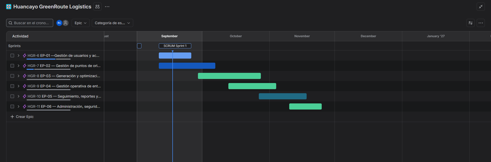
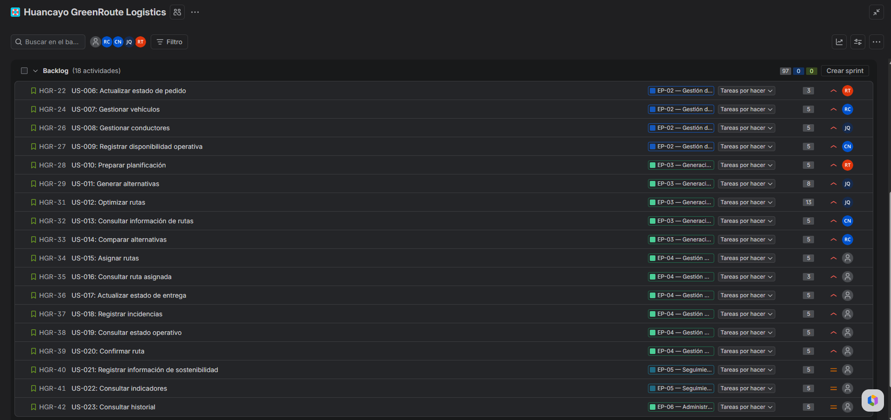
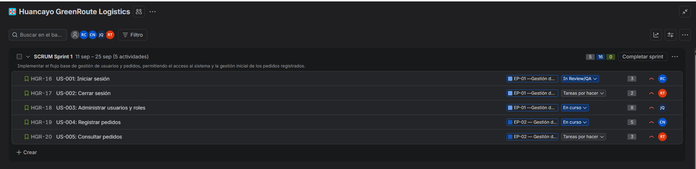
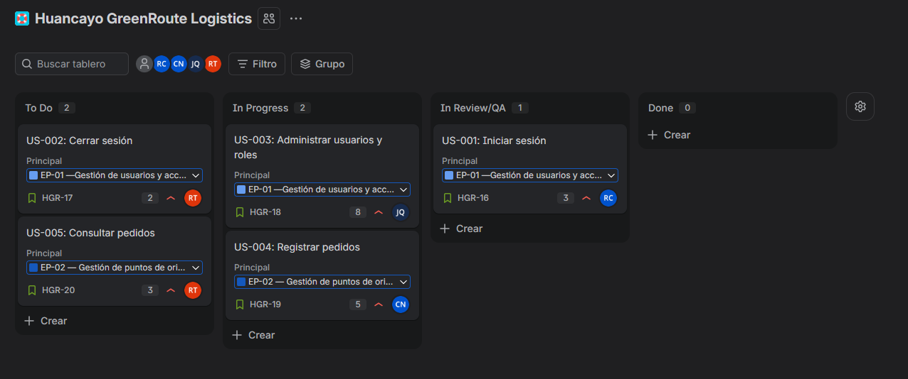
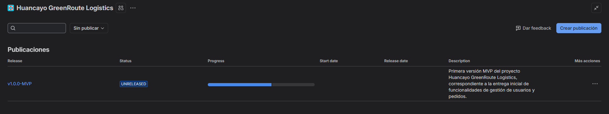

# 02 Artefactos Jira V_1_0_0

[← Volver al README Principal](../../README.md)

## 1. Metadatos del documento

| Campo | Detalle |
|---|---|
| **Proyecto** | Plataforma web con Algoritmo Genético para optimizar rutas sostenibles de última milla en Huancayo |
| **Espacio Jira** | Huancayo GreenRoute Logistics |
| **Artefacto** | Evidencias de configuración y gestión en Jira Software |
| **Versión** | 1.0.0 |
| **Estado** | En elaboración |
| **Fecha** | 17/09/2026 |
| **Integrantes** | Flores, Toribio, Ricardo Miguel; Janampa, Navarro, Clinton; Rupay, Chira, Rosalyn Exkra; Veliz de la Cruz, Carlos Adrian |

---

## 2. Objetivo del artefacto

Documentar mediante evidencias visuales la configuración y uso de Jira Software para la gestión ágil del proyecto, demostrando la organización del trabajo mediante épicas, backlog priorizado, planificación del Sprint 1, tablero Scrum y gestión de versiones o *releases*.

Las capturas incorporadas en este documento corresponden únicamente a los paneles necesarios de Jira Software, evitando incluir elementos ajenos a la evidencia requerida.

---

## 3. Evidencia 1: Roadmap del proyecto

La siguiente evidencia muestra el cronograma general del proyecto en Jira Software. En la vista se observan las épicas distribuidas temporalmente, permitiendo visualizar su secuencia y relación con la planificación del proyecto.

Se identifican las siguientes épicas:

- **EP-01:** Gestión de usuarios y acceso.
- **EP-02:** Gestión de puntos de origen y pedidos.
- **EP-03:** Generación y optimización de rutas.
- **EP-04:** Gestión operativa de entregas.
- **EP-05:** Seguimiento, reportes y sostenibilidad.
- **EP-06:** Administración, seguridad y auditoría.

La planificación evidencia una organización progresiva de las funcionalidades, iniciando con los componentes base de acceso y gestión, y continuando con los módulos de optimización, operación, seguimiento y administración.

**Interpretación de la evidencia:**  
El roadmap permite visualizar la distribución temporal de las principales épicas y facilita la coordinación de las entregas previstas durante la ejecución del proyecto.

---

## 4. Evidencia 2: Backlog priorizado

La siguiente evidencia presenta el backlog del proyecto configurado en Jira Software. Se observan historias de usuario identificadas mediante códigos `US-XXX`, asociadas a sus respectivas épicas y estimadas mediante Story Points utilizando valores de la secuencia de Fibonacci.

Entre los elementos visibles del backlog se encuentran historias relacionadas con:

- Actualización del estado de pedidos.
- Gestión de vehículos.
- Gestión de conductores.
- Registro de disponibilidad operativa.
- Preparación de la planificación.
- Generación de alternativas.
- Optimización de rutas.
- Consulta de información de rutas.
- Comparación de alternativas.
- Asignación de rutas.
- Seguimiento operativo e indicadores.

Asimismo, las historias se encuentran vinculadas a diferentes épicas del proyecto y cuentan con estimaciones de esfuerzo como `3`, `5`, `8` y `13` Story Points.

**Interpretación de la evidencia:**  
El backlog permite organizar y priorizar el trabajo pendiente, mantener la trazabilidad entre historias de usuario y épicas, y estimar el esfuerzo requerido para su desarrollo.

---

## 5. Evidencia 3: Sprint Planning y Sprint Goal

La siguiente evidencia corresponde a la planificación del **Sprint 1**, configurado para el periodo comprendido entre el **11 y el 25 de septiembre**.

El Sprint Goal definido es:

> **Implementar el flujo base de gestión de usuarios y pedidos, permitiendo el acceso al sistema y la gestión inicial de los pedidos registrados.**

Dentro del Sprint 1 se encuentran seleccionadas las siguientes historias:

| Historia | Descripción | Story Points |
|---|---|---:|
| **US-001** | Iniciar sesión | 3 |
| **US-002** | Cerrar sesión | 2 |
| **US-003** | Administrar usuarios y roles | 8 |
| **US-004** | Registrar pedidos | 5 |
| **US-005** | Consultar pedidos | 3 |

Las historias presentan diferentes estados de avance, responsables asignados y asociación con las épicas correspondientes.

**Interpretación de la evidencia:**  
La planificación del Sprint 1 delimita el trabajo de la iteración y establece una meta concreta orientada a implementar las funcionalidades iniciales de acceso, usuarios y pedidos.

---

## 6. Evidencia 4: Tablero Scrum activo

La siguiente evidencia muestra el tablero Scrum utilizado para gestionar el flujo de trabajo del Sprint 1. El tablero se encuentra organizado en las siguientes columnas:

- **To Do:** historias pendientes de iniciar.
- **In Progress:** historias actualmente en desarrollo.
- **In Review/QA:** historias que se encuentran en revisión o validación.
- **Done:** historias que han cumplido los criterios definidos para considerarse finalizadas.

En la evidencia se observa que las historias del Sprint se encuentran distribuidas entre `To Do`, `In Progress` e `In Review/QA`. La columna `Done` se encuentra actualmente vacía, debido a que las historias todavía no han completado todos los criterios necesarios para considerarse terminadas.

**Interpretación de la evidencia:**  
El tablero permite visualizar de forma directa el estado actual de cada historia de usuario y facilita el seguimiento del trabajo durante el Sprint.

---

## 7. Evidencia 5: Gestión de versiones / Release

La siguiente evidencia muestra la configuración de la primera versión del producto en Jira Software:

- **Versión / Release:** `v1.0.0-MVP`
- **Estado:** `UNRELEASED`
- **Descripción:** Primera versión MVP del proyecto Huancayo GreenRoute Logistics, correspondiente a la entrega inicial de funcionalidades de gestión de usuarios y pedidos.

La versión presenta una barra de progreso, lo que evidencia que existen actividades asociadas a la publicación. El estado `UNRELEASED` es coherente con el hecho de que el Sprint continúa en ejecución y las funcionalidades incluidas en la versión aún no han sido liberadas formalmente.

**Interpretación de la evidencia:**  
La gestión de versiones permite agrupar funcionalidades planificadas para una entrega determinada y realizar seguimiento a su avance antes de la publicación oficial.

---

## 8. Resumen de cumplimiento de evidencias

| N.° | Evidencia requerida | Estado |
|---:|---|---|
| 1 | Roadmap del Proyecto | ✅ Incorporada |
| 2 | Backlog Priorizado | ✅ Incorporada |
| 3 | Sprint Planning & Sprint Goal | ✅ Incorporada |
| 4 | Tablero Scrum Activo | ✅ Incorporada |
| 5 | Gestión de Versiones / Release | ✅ Incorporada |

---

## 9. Conclusiones

La configuración realizada en Jira Software permite gestionar el proyecto mediante un enfoque ágil y mantener trazabilidad entre épicas, historias de usuario, Sprint, estados de trabajo y versiones del producto.

Las evidencias presentadas muestran que el proyecto cuenta con una estructura de trabajo organizada mediante roadmap, backlog priorizado, Sprint 1, tablero Scrum y una primera versión `v1.0.0-MVP`.

El uso de estas herramientas facilita el seguimiento del avance del proyecto y proporciona una base visible para la coordinación del equipo durante las siguientes iteraciones.

---

## 10. Historial de control de cambios

| Versión | Fecha | Descripción del cambio |
|---|---|---|
| **1.0.0** | 17/09/2026 | Creación inicial del documento con las cinco evidencias requeridas de Jira Software. |

---

