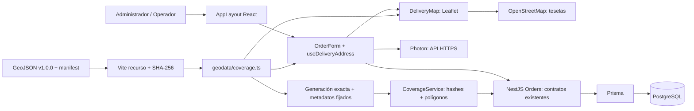

# 05. Mejoras posteriores al Sprint 1 V_1_1_0

## Datos y control de versión

| Campo | Valor |
|---|---|
| Proyecto | Plataforma web con Algoritmo Genético para optimizar rutas sostenibles de última milla en Huancayo |
| Repositorio | DistriRapido |
| Identidad de la interfaz vigente | EcoRuta Huancayo, según los ajustes autorizados por el usuario |
| Versión documental | V_1_1_0 |
| Fecha | 2026-10-08, America/Lima |
| Línea base de Git | `33d6139` — cierre de Sprint 1 |
| Estado | Mejoras locales posteriores al cierre; entrega pendiente de revisión, sin commit/push |

Este addendum complementa la documentación de inicio y los entregables del Sprint 1 sin reescribirlos. Se conservan sus títulos oficiales y versiones V_1_0_0/V_1_1_0. La revisión es incremental: no justifica V_2_0_0, no declara inicio de Sprint 2 y no acredita aceptación formal ni liberación.

## Alcance implementado

| Refinamiento posterior | Estado y trazabilidad |
|---|---|
| Layout responsive compartido | `AppLayout` con sidebar desde 1024 px y menú plegable por debajo. Contenido, formularios y mapa permanecen montados. Refina navegación de US-001 a US-005. |
| Login | Imagen decorativa aportada por el usuario, `cover`, encuadre responsive, sin overlay blanquecino añadido. Marca y formulario a dos columnas en escritorio; apilado en tablet/móvil. Autenticación de RF-001 → US-001/US-002 intacta. |
| Panel administrativo | Resumen general con pedidos registrados, pendientes, usuarios y estados reales; una solicitud agregada exclusiva del Administrador. Bienvenida y tres tarjetas de acceso a rutas existentes, sin información de cuenta/rol duplicada en contenido ni cifras ficticias. Refina RF-002 → US-003 y accesos a US-004/US-005. Mantiene sesión visible y opciones de los otros roles. |
| Registro | Un formulario: cliente/carga y programación en dos columnas de escritorio; ubicación debajo a todo el ancho. Horarios compactos, leyenda horizontal/compacta, confirmación junto al buscador y botón final destacado. Refina RF-003 → US-004. |
| Cobertura | Frontend aplica polígonos administrativos v1.0.0, límites visibles, leyenda y «Ver cobertura». Filtra sugerencias y valida clic/arrastre/Enter/envío. Refina ubicación confirmada de RF-003 y RN-004. Backend aplica la misma política antes de la transacción. |
| Marcador | Magenta, 36 px, selección explícita, coordenadas a seis decimales, zoom 17 y mapa visible. Repetir la misma sugerencia vuelve a centrar. Error inverso o edición elimina confirmación. Refina US-004. |
| Consulta | Mantiene búsqueda, filtros, paginación y detalle de solo lectura de RF-004 → US-005. Sin edición, eliminación ni estados nuevos. |

La reconciliación conserva la estructura src/frontend y src/backend de main. El incremento de indicadores añade GET /admin/summary y su módulo backend protegido; no cambia Prisma, migraciones, PostgreSQL, variables de entorno ni dependencias de la aplicación. La fase técnica posterior adapta Docker y añade validación geográfica, sin modificar datos. La preparación geográfica usa Shapely como herramienta temporal, no como dependencia del frontend/backend.

## Extensión verificable de RF-003 y RN-004

Se conservan los identificadores de la [especificación funcional V_1_1_0](../01%20Inicio/06.%20Requisitos%20funcionales%20V_1_1_0.md) y [reglas V_1_1_0](../01%20Inicio/09.%20Reglas%20de%20negocio%20V_1_1_0.md). Las reglas siguientes complementan la ubicación confirmada de RF-003/RN-004; no constituyen otra historia de Sprint 2.

| Criterio | Implementación actual | Pendiente |
|---|---|---|
| Destino autorizado | Huancayo 120101, Chilca 120107, El Tambo 120114, Huancán 120119 y Pilcomayo 120125; provincia Huancayo, departamento Junín, Perú. | Implementada en API antes de persistencia; prueba PostgreSQL aislada pendiente. |
| Exclusiones | Sapallanga, San Agustín de Cajas y Sicaya reservados; Jauja y cualquier punto exterior no se seleccionan como destinos confirmados. | Rechazo backend implementado antes de crear Cliente/Pedido. |
| Referencia territorial | Límites administrativos completos, incluyendo zonas rurales. No se inventaron polígonos urbanos ni buffers. | Cualquier reducción urbana requerirá decisión explícita y versión nueva. |
| Precisión y borde | Evaluar y enviar punto redondeado a seis decimales; aceptar bordes exteriores y de huecos, rechazar interior de huecos; menor UBIGEO para etiqueta en bordes compartidos. | Política única reutilizada mediante generación exacta y pruebas de paridad. |
| Confirmación | Escribir no confirma. Elegir sugerencia válida sí; clic/arrastre/Enter esperan búsqueda inversa correcta y vigente. Editar o fallar la búsqueda inversa impide envío. | API valida pertenencia independientemente del frontend. |
| Integridad | Verificar hash, versión y estructura al cargar; sin datos verificables se bloquea confirmación. | API verifica datos al iniciar; HTTP 503 ante fallo, sin escrituras. |

### Criterios de aceptación complementarios

- Dado un resultado válido de Plaza de la Constitución, Huancayo, al elegirlo con clic o Enter, el formulario confirma las coordenadas redondeadas y el mapa muestra el marcador centrado a zoom 17.
- Dado «Tambo» con resultados ambiguos, solo se ofrecen coordenadas cubiertas; nombres administrativos no sustituyen la comprobación del polígono.
- Dado un marcador confirmado, al arrastrarlo fuera de cobertura, editar la dirección o fallar una consulta inversa, desaparece la confirmación y no se envía el formulario.
- Dado un fallo de integridad/carga, clic, teclado y envío no confirman destinos.
- Dado un registro válido enviado a la API simulada, las coordenadas del payload coinciden con el punto realmente confirmado, no con una dirección anterior ni con una respuesta tardía.
- La API aplica ahora el rechazo anterior a la transacción: 400 por punto exterior/inválido y 503 por cobertura no verificable. Las pruebas HTTP usan Prisma simulado; no acreditan persistencia real en PostgreSQL.

## Arquitectura vigente complementaria al C4

El [Modelo C4 V_1_1_0](../01%20Inicio/12.%20Modelo%20C4%20V_1_1_0.md) conserva el estado auditado del Sprint 1. Este diagrama añade los componentes posteriores implementados:

Leaflet es biblioteca del navegador, no contenedor. OpenStreetMap entrega teselas y Photon geocodificación; ninguno implementa rutas/optimización. OSRM y el Algoritmo Genético permanecen planificados. El GeoJSON es estático y versionado; no se descarga INEI en cada consulta. `coverage.ts` contiene funciones puras, sin copias manuales de límites; frontend y backend comparten la fuente; los archivos TypeScript de backend son generados, no mantenidos manualmente.

La búsqueda usa foco Huancayo, país PE y bbox derivado, `limit=15` antes del filtrado. Ese límite actual sustituye la descripción de cinco sugerencias de la auditoría histórica del stack. Conserva debounce 700 ms, caché 50 consultas, timeout 10 s y cancelación. La selección explícita dispara el centrado mediante revisión de foco, separada de actualizaciones por arrastre, para evitar recentrados involuntarios.

## Fuente y limitaciones geográficas

Datos del [portal institucional INEI](https://ide.inei.gob.pe/) y su descarga `Distrito.rar`. La etiqueta es «Actualizado al 2023»; `gpkg_last_change` de 2026 es metadato interno y no prueba vigencia administrativa a 2026. El paquete mantiene EPSG:4326/WGS84, longitud/latitud, atributos y geometría sin simplificación ni exclusión rural.

Se preservan el manifiesto, hashes y validación original en [geodata](../../geodata/README.md). La aprobación es provisional; los límites no garantizan acceso vial o exactitud jurídica. No se verificó licencia explícita de redistribución del archivo, por lo que su inclusión en el remoto público queda condicionada a aclarar permisos. No se publican RAR/GPKG originales.

## Pendientes y alcance futuro

1. Aclarar redistribución INEI y procedencia autorizada de los recursos visuales antes de publicación. La imagen fue suministrada por el usuario; no se dispone de una licencia independiente documentada para publicación pública.
2. Mantener privado el empaquetado compartido: Docker utiliza contexto raíz con copias selectivas. Los resultados ejecutados se consignan en el informe 05; no equivalen a autorización de publicar imágenes.
3. Validación canónica implementada en `OrdersService.create` antes de la transacción: exterior/inválido → 400; cobertura no disponible/verificable → 503. Consulta histórica y guards permanecen, sin migraciones ni eliminación de registros. Verificar posteriormente persistencia en base aislada.
4. Probar HTTP + PostgreSQL en base aislada y paridad de políticas/fixtures frontend/backend. No usar bases reales para tests de escritura.
5. Flota, conductores operativos, estados, OSRM, optimización, PWA y auditoría operativa siguen planificados. No están implementados por estas mejoras y no se incorporan a esta entrega.

## Evidencias y trazabilidad

Los indicadores están documentados en [el incremento administrativo](evidencias-tecnicas/Post-Sprint-1/02%20Resumen%20administrativo%20V_1_1_0.md); las verificaciones e inventario vigentes de la nueva estructura constan en [la reconciliación sobre main](evidencias-tecnicas/Post-Sprint-1/04%20Reconciliación%20sobre%20main%20V_1_1_0.md). Los informes previos son fotografías de sus respectivas fases.

- [Informe actual de verificación y entrega](evidencias-tecnicas/Post-Sprint-1/01%20Verificación%20y%20entrega%20V_1_1_0.md).
- [Integración de cobertura](../../geodata/FRONTEND-INTEGRATION.md) y [corrección del marcador](../../geodata/MARKER-SYNC.md): conservan sus resultados de fase separados de los actuales.
- El [índice histórico del Sprint 1](evidencias-tecnicas/Sprint-1/README.md) y los cuatro entregables académicos no se modificaron para atribuirles estas mejoras.

## Fase técnica posterior autorizada

La documentación V_1_1_0 se conserva como addendum incremental. [Validación backend y empaquetado V_1_1_0](evidencias-tecnicas/Post-Sprint-1/05%20Validación%20backend%20y%20empaquetado%20V_1_1_0.md) registra los archivos, reglas, aprovisionamiento privado, migraciones explícitas y resultados de 2026-10-09. Los informes del cierre del Sprint 1 y las evidencias anteriores no fueron reescritos.

## Siguiente documento / Siguiente trabajo recomendado

Resolver y documentar los permisos de redistribución INEI antes de publicar datos o imágenes. Revisar la evidencia técnica 05 y verificar persistencia en una base exclusivamente de pruebas, sin utilizar los registros existentes.
